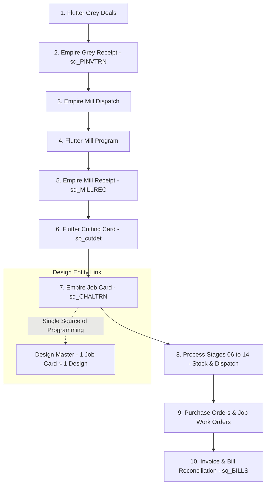
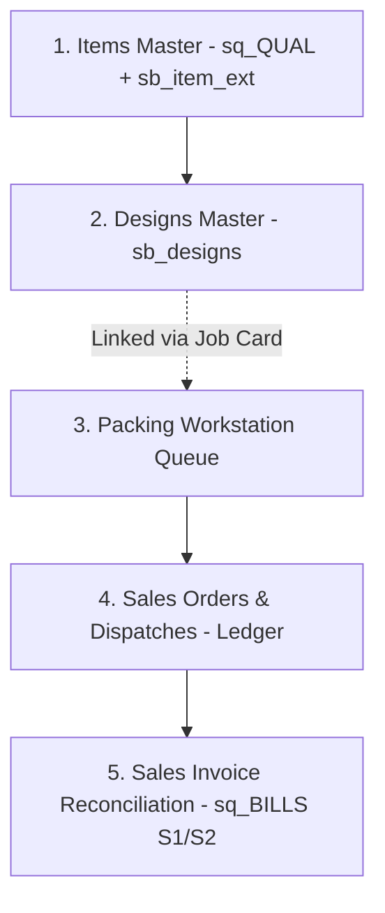

# Master Architecture Plan & 1-Week Roadmap — Ambaji Sarees ERP

> **Vision**: Transform Ambaji Sarees ERP into a state-of-the-art hybrid production, manufacturing, sales, and financial ecosystem. Combines Airbyte-managed read-only mirrors (`sq_`), rich custom ERP enhancements (`sb_`), a smart Replica & Reconciliation Engine, and a world-class UI/UX.

---

## 1. Master Data Strategy: 50% / 25% / 25% Architectural Split

```
                              ┌─────────────────────────────────────────┐
                              │       AMBAJI SAREES ERP ECOSYSTEM       │
                              └────────────────────┬────────────────────┘
                                                   │
        ┌──────────────────────────────────────────┼──────────────────────────────────────────┐
        ▼                                          ▼                                          ▼
┌──────────────────────────────┐        ┌──────────────────────────────┐        ┌──────────────────────────────┐
│  50% READ-ONLY (`sq_`)       │        │  25% HYBRID (`sq_` + `sb_`)  │        │  25% PURE NATIVE (`sb_`)     │
├──────────────────────────────┤        ├──────────────────────────────┤        ├──────────────────────────────┤
│ • Mill Dispatches            │        │ • Items Master (`sq_QUAL`)   │        │ • Flutter Grey Deals         │
│ • Mill Receipts (`sq_MILLREC`)│       │ • Job Cards (`sq_CHALTRN`)   │        │ • Designs Master             │
│ • Purchase Bills (`sq_BILLS`)│        │ • Cutting Cards (`sb_cutdet`)│        │ • Packing Verification       │
│ • Sales Invoices (`sq_BILLS`)│        │ • POs & Job Work Orders      │        │ • Sales Orders & Dispatches  │
└──────────────────────────────┘        └──────────────────────────────┘        └──────────────────────────────┘
```

### A. 50% Read-Only Modules (`sq_` Tables)
- Direct high-speed aggregated queries from Airbyte-managed `sq_` tables (`sq_MILLREC`, `sq_PINVTRN`, `sq_BILLS`, `sq_CHALTRN`, `sq_BILLDET`).
- **Contract**: Strictly read-only; no direct SQL mutations on `sq_` tables.

### B. 25% Hybrid Modules (`sq_` Base + `sb_` Enrichment)
- Base transaction headers/lines read from `sq_` tables, joined with rich custom `sb_` tables on 100% Primary Keys (`VNO`, `CNO`, `TYPE`, `qcode`).
- Captures extended business attributes (e.g. true landed cost, custom notes, item aliases, extra process specs, approval state).

### C. 25% Pure Native Modules (`sb_` Tables)
- Built 100% natively in Flutter + Supabase Postgres 17 (`IMMBE2627` schema).
- Powers new features: **Grey Deals**, **Design Catalog**, **Packing Queue**, **Sales Order Ledger**, and **Smart Auto-Reconciliation**.

---

## 2. Replica System & Smart Auto-Reconciliation Engine

### A. Sequence Generation & Staging Inbox
- **Sequence Generator**: Computes `MAX(VNO)` across both `sq_` and `sb_` tables to guarantee zero sequence collisions.
- **Incoming Activity Inbox**: Displays daily incoming entries (new mill receipts, purchase bills, sales invoices) in a dedicated verification panel.
- **Empire Entry Notification**: When staff create an entry in Flutter (e.g., PO or Cutting Card), the system queues a notification for shopfloor staff to replicate/confirm the entry in Empire.

### B. Smart Auto-Reconciliation Workflow
1. **100% Primary Key Match (Auto-Verified)**: Matches `(VNO, CNO, TYPE)` or `DESPNO` automatically. Shown with a **Green Verified Badge**.
2. **Suggested AI Linking**: Matches by fuzzy fabric quality, piece count, date range, or mill name. Shown with a **Yellow Suggested Link Badge** for 1-click user confirmation.
3. **Unlinked / Exception Queue**: Highlighted with a **Red Action Required Badge** for manual matching.

---

## 3. End-to-End Production & Material Pipeline



### Production Workflow Contract:
- **Design Linking**: Job Cards (`sq_CHALTRN` / `sb_jobcards`) act as the **single source of programming linking production to sales**. Each Job Card is bound 1-to-1 to a **Design Entity**.
- **Stage 06–14 Material Flow**: Tracks stock, dispatches, job work, and mill processing across stages 06 through 14.
- **PO & Bill Matching**: Purchase Orders and Job Work bills automatically reconcile against incoming `sq_BILLS` records.

---

## 4. End-to-End Sales & Inventory Pipeline



### Sales Workflow Contract:
- **Items (`sq_QUAL` + `sb_item_ext`)**: Rich item master with selling prices (`SELL1`), GST (`GSTRATE`), HSN codes, price history audit log, and item alias tracking.
- **Designs (`sb_designs`)**: Design catalog linked directly to Job Cards and Sales Items.
- **Packing Queue**: Every incoming finished lot automatically generates a pending packing entry in the verification inbox for staff confirmation.
- **Sales Orders & Dispatches**: Full ledger maintaining all sales transactions, customer orders, and dispatch slips.
- **Invoice Reconciliation**: Dispatches auto-match and reconcile against incoming sales invoices (`sq_BILLS` type `S1`/`S2`).

---

## 5. Phased 1-Week Execution Roadmap

```
┌────────────────────────────────────────────────────────────────────────────────────────┐
│ DAY 1: Architecture Alignment & Core Database Extensions (`sb_item_ext`, `sb_designs`) │
├────────────────────────────────────────────────────────────────────────────────────────┤
│ DAY 2: Items Master (`sq_QUAL` + `sb_item_ext`) & Price Audit / Renaming Engine        │
├────────────────────────────────────────────────────────────────────────────────────────┤
│ DAY 3: Designs Master (`sb_designs`) & Job Card Integration (`1 Job Card ≈ 1 Design`)  │
├────────────────────────────────────────────────────────────────────────────────────────┤
│ DAY 4: Packing Workstation & Daily Verification Inbox Engine                           │
├────────────────────────────────────────────────────────────────────────────────────────┤
│ DAY 5: Sales Orders, Dispatches & Transaction Ledger (`sb_sales_orders`, `sb_dispatch`)│
├────────────────────────────────────────────────────────────────────────────────────────┤
│ DAY 6: Purchase Orders, Job Work & `sq_BILLS` Reconciler Engine                        │
├────────────────────────────────────────────────────────────────────────────────────────┤
│ DAY 7: End-to-End Integration, Verification Suite & Production Deployment              │
└────────────────────────────────────────────────────────────────────────────────────────┘
```
