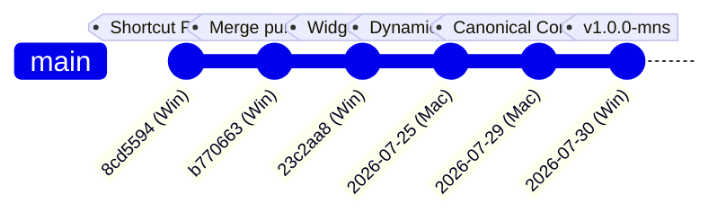

# Git Operations & Cross-Machine Workflow Registry

> **Project**: Ambaji Sarees ERP
> **Primary Workstations**:
> - 💻 **`[Windows Workstation]`**: Windows Desktop Primary Engine (`flutter run -d windows`)
> - 🍏 **`[MacBook Workstation]`**: macOS & iOS Secondary Engine (`flutter run -d macos`)
> **Default Branch**: `master` · Remote Origin: `origin/master`

---

## 🔀 Branch Topology & Git History



---

## 📊 Cross-Machine Operations Log

| Date | Machine Agent | Action | Target Branch / Hash | Key Changes & Objectives |
| :--- | :--- | :--- | :--- | :--- |
| **2026-08-04** | 🍏 `[MacBook Workstation]` | **Commit & Push** | `master` (`e4cc55b`) | Engineered Add Cutting Card batch creation flow (`MdlCcBatchInput`, `srv_cc.dart`, `scr_cc_form.dart`), joined `sq_PINVTRN` by `DESPNO` for grey rates, resolved generated column & user UUID constraints, and verified live creation of `CC-0332` in Supabase. |
| **2026-08-03** | 🍏 `[MacBook Workstation]` | **Commit & Push** | `master` (`origin/master`) | Enhanced `MdlCcHeader` & `MdlCcLineItem` (`mdl_cc.dart`), added native subpage content switcher to `DyPageCanvas`, refactored `ScrCcLanding` to 4-Shell Architecture (`Dash`, `Details`, `Reports`, `Tasks`), and retired legacy `scr_cc_dashboard_pane.dart` & `scr_cc_form_dialog.dart`. |
| **2026-08-02** | 💻 `[Windows Workstation]` | **Commit & Push** | `master` (`origin/master`) | Engineered `PageSubpages` 36px toggle bar & `PageHeader` refactoring, DAB 8-slot reordering, 4-shell architecture (`dy_shl_dash`, `dy_shl_details`, `dy_shl_reports`, `dy_shl_tasks`), 150ms `AnimatedSwitcher` cross-fade transition, & `ANTIRULES.md`. |
| **2026-08-01** | 🍏 `[MacBook Workstation]` | **Commit & Push** | `master` (`50826ec`) | Rebuilt master `DyTable` 3-tiered row engine (`group_row`, `def_row`, `child_row`, `footer`), thumbnail lightbox modal, `PageHeader` full-width & Spacer 100% free space allocation fix, `PageTabs` interactive content switcher, and Purchase Orders landing integration. |
| **2026-08-01** | 💻 `[Windows Workstation]` | **Commit & Push** | `master` (`origin/master`) | Architected `DyGridSystem`, `DyColorSystem`, 4-Column Board View, `dy_page_header` consolidation, `DyPaginationRow` standardization, & Modular ERP Table System Architecture Plan (`04_modular_table_system_plan.md`). |
| **2026-07-31** | 🍏 `[MacBook Workstation]` | **Commit & Push** | `master` (`85d7398`) | Standardized `DynamicDenseTable`, `DynamicPagination`, `MicroButton` zero-shift contract, master `dynamic_ai` architecture docs, 21-component progress tracker, & multi-agent SOP. |
| **2026-07-30** | 💻 `[Windows Workstation]` | **Tag & Push** | `v1.0.0-mns` | Officially tagged **`v1.0.0-mns`** baseline for production MNS release (`po`, `cc`, `pb`). Archived legacy Organism prototype build as **`v0.0.1`** in `_backups/releases/`. |
| **2026-07-30** | 💻 `[Windows Workstation]` | **Commit & Push** | `master` (`origin/master`) | MNS architecture overhaul for Cutting Cards (`cc`) and Purchase Bills (`pb`), line item source routing (`sq_PINVTRN` for Grey, `sq_MILLREC` for Mill, `sq_BILLDET` for others), MicroButton overflow fix, & retired 11 legacy production files. |
| **2026-07-29** | 🍏 `[MacBook Workstation]` | **Commit & Push** | `master` (`origin/master`) | Shipped 7 canonical core data models (`sq_bills`, `sq_pinvtrn`, `sq_millrec`, `sq_chaltrn`, `sq_billdet`, `sb_cutdet`, `sb_cutdet_summary`), 7 core services, 3-way card linkage engine, Mill Programs module, `GEMINI.md` Section 9, & legacy reference cleanup. |
| **2026-07-29** | 💻 `[Windows Workstation]` | **Commit & Push** | `master` (`origin/master`) | Standardized 12px/8px/8px vertical gap tokens, DAB 34px height alignment, crisp white autocompletes, tooltipped grouping switcher, and DDT row grouping column-aligned summary view. |
| **2026-07-28** | 🍏 `[MacBook Workstation]` | **Commit & Merge & Push** | `master` (`origin/master`) | Shipped 3-state `PageHeader` (`standard`, `adding`, `editing`), zero-overhead `PageFormCanvas` with pixel-perfect 1200px max-width alignment, dedicated 2-column form layout (`CreatePageLayout`), dynamic list/content pane skeletons, and symmetric 12px (`shad.padMd`) `HeaderTabs` child padding. |
| **2026-07-27** | 💻 `[Windows Workstation]` | **Commit & Push** | `master` (`origin/master`) | Shipped 3-area Table Footer, dynamic `Stone 980` (2% dark tint) surface tokens, fabric thumbnails + gallery overlay, updated dev_log & git_entry. |
| **2026-07-26** | 💻 `[Windows Workstation]` | **Commit** | `master` | Standardized `header_tabs.dart` Slate 10 token, Sidenav Slate 50 palette, and global keyboard state machine. |
| **2026-07-25** | 🍏💻 `[MacBook & Windows]` | **Commit & Merge** | `master` (`purorders`, `recipes`, `crm`) | Merged Multi-Module SOP (`docs/workflow_multi_branch_guide.md`), Purchase Orders 5-module workflow (`purorders`), Mill Printing Recipes (`sb_recipe_mill`), Google Contacts Sync Engine, DynamicDenseTable, & native `shadcn_flutter` rules. |
| **2026-07-20** | 💻 `[Windows Workstation]` | **Commit & Push** | `master` | Refactored accordion sidebar, generic child layout sizing engine, and 12-item quick action wrap grid. |
| **2026-07-19** | 💻 `[Windows Workstation]` | **Commit & Push** | `master` | Built reusable `PageHeader` component (`page_header.dart`) and launched background Levitation management client. |
| **2026-07-18** | 🍏 `[MacBook Workstation]` | **Commit & Merge** | `master` | Resolved cutting card total investment calculation bug (`CC-0290`), updated Edge Function `create-cutting-batch` v13. |
| **2026-07-17** | 💻 `[Windows Workstation]` | **Commit & Push** | `master` | Built Stitching tasks reconciliation view, Designs SKU catalog dashboard (`sb_designs`), and denormalized `sb_cutdet_summary`. |
| **2026-07-16** | 💻 `[Windows Workstation]` | **Commit & Push** | `master` | Shipped central Media Library Explorer (`media_screen.dart`), inline scan attachments, and single-step auto-rename. |
| **2026-07-15** | 💻 `[Windows Workstation]` | **Commit & Merge** | `master` (`whatsapp`, `purorders`) | Merged WhatsApp CRM companion workstation & Purchase Orders 5-module workflow into `master`. |

---

## 🚀 Mac Handoff Checklist (Next Steps)

1. **On your MacBook Workstation**:
   ```bash
   cd ~/path/to/textile_erp
   git checkout master
   git pull origin master
   flutter pub get
   flutter run -d macos
   ```
2. Both `docs/dev_log.md` and `docs/git_entry.md` are synchronized with `origin/master`.
