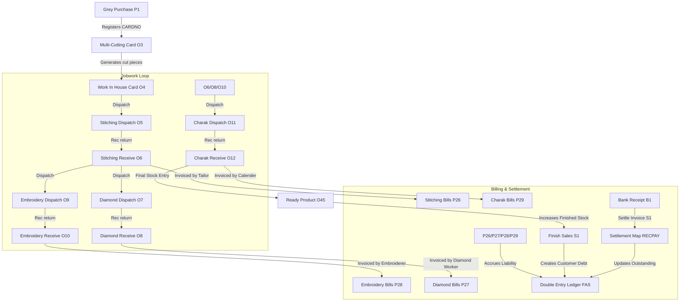

# Ambaji Sarees ERP: Legacy Voucher Modules Reference Guide

This document acts as the definitive single source of truth for the **73 legacy voucher modules** (defined in the legacy [Voucher Series Master (sq_SERIES)](file:///c:/Users/smitt/.gemini/antigravity/scratch/textile_erp/backend/schema_docs/01_constants/sq_SERIES.md) and mapped in [legacy_constants.dart](file:///c:/Users/smitt/.gemini/antigravity/scratch/textile_erp/frontend/lib/constants/legacy_constants.dart)). It classifies them into logical groups, explains their operational purpose, and analyzes how they are interconnected in the production, sales, and accounting lifecycles.

---

## 📊 Summary of Groups

All 73 modules are categorised into **7 core business groups**:

| Group | Category | Voucher Count | Core Focus |
|---|---|---|---|
| **A** | Core Financials, Banking & Adjustments | 17 | Cash, bank, expense ledger entries, and year-end books closing |
| **B** | Raw Materials & General Procurement | 11 | Purchase of raw grey fabric, laces, packing materials, and services |
| **C** | Sales & Outward Distribution | 7 | Sales invoicing, fents (scrap), cash sales, and grey sales |
| **D** | Jobwork & Processing Bills (Inward) | 6 | Processing bills received from tailors, embroiderers, and calenders |
| **E** | Production Flow & Challans (O-Series) | 16 | Job cards, internal transfers, and process-wise contractor dispatches |
| **F** | Orders & Purchase Intents | 4 | Order booking for customers (Sales Orders) and raw material POs |
| **G** | Debit & Credit Notes (Adjustments) | 12 | Commercial discounts, returns, and tax rate differences |

---

## 📂 Detailed Module Directory by Group

---

### Group A: Core Financials, Banking & Adjustments (17 Modules)
These modules handle double-entry accounting updates, direct payments, collections, general ledger adjustments, and tax calculations. They read from and write to the central [General Ledger (sq_FAS)](file:///c:/Users/smitt/.gemini/antigravity/scratch/textile_erp/backend/schema_docs/05_financials/sq_FAS.md) engine.

| Code | Voucher Module Name | Direction | Relational DB Table | Business & Financial Purpose |
|---|---|---|---|---|
| **`00`** | OPENING BALANCE | N/A | `sq_FAS` | Initializes the general ledger at the start of a fiscal year with opening debit/credit balances. |
| **`B1`** | BANK RECEIPT | Inward | `sq_BILLS`, `sq_RECPAY` | Records customer payments cleared through banks ([sq_banks](file:///c:/Users/smitt/.gemini/antigravity/scratch/textile_erp/backend/schema_docs/01_constants/sq_banks.md)). Credits customer debtor accounts. |
| **`B2`** | BANK PAYMENT | Outward | `sq_BILLS`, `sq_RECPAY` | Records payments to weavers, jobworkers, or suppliers via bank. Debits creditor ledger accounts. |
| **`C1`** | CASH RECEIPT | Inward | `sq_BILLS`, `sq_RECPAY` | Records physical cash collection. Debits Cash account and credits debtor account. |
| **`C2`** | CASH PAYMENT | Outward | `sq_BILLS`, `sq_RECPAY` | Records cash outlays for local expenses, petty cash, or minor vendors. |
| **`E1`** | EXPENSES | N/A | `sq_FAS` | General Journal Voucher for recording business expenses (rent, utility, salary) where no invoice exists. |
| **`E2`** | EXCISE | N/A | `sq_FAS` | Legacy module for recording pre-GST Central Excise Duty liabilities and adjustments. |
| **`J2`** | JOURNAL | N/A | `sq_FAS` | General adjustment JVs (e.g., depreciation, provisions, write-offs) with no cash/bank effect. |
| **`OA`** | ADVANCE RECEIPT VOUCHER | Inward | `sq_BILLS` | GST-compliant advance collection registry. Creates dynamic GST liability before billing. |
| **`OF`** | ADVANCE REFUND VOUCHER | Outward | `sq_BILLS` | Reverses an advance receipt voucher and returns funds to customer if order is cancelled. |
| **`T1`** | TDS | N/A | `sq_FAS` | Records direct Tax Deducted at Source (TDS) entries against vendor/government accounts. |
| **`V1`** | VATAV | N/A | `sq_FAS` | Automatically records minor penny adjustments/discounts during invoice settlements. |
| **`V2`** | CLOSING ENTRIES (TRADING) | N/A | `sq_FAS` | Year-end adjustments transferring trading ledger balances to gross profit accounts. |
| **`V3`** | CLOSING ENTRIES (P & L) | N/A | `sq_FAS` | Year-end adjustments transferring operating ledger balances to net profit/loss accounts. |
| **`V4`** | VAT JV | N/A | `sq_FAS` | Legacy VAT / modern GST input credit adjustment journal entries. |
| **`V5`** | COMMISSION JVS | N/A | `sq_FAS` | Adjusting ledger entries to record commissions due to brokers/agents. |
| **`XX`** | UNADJ PAYMENT | Inward | `sq_RECPAY` | Records payments received from customers that cannot yet be allocated to a specific invoice. |

---

### Group B: Raw Materials & General Procurement (11 Modules)
These modules record the inward purchase of fabrics, embellishments, trims, and packaging materials. They create accounts payable liabilities and set up inventory tracking ids.

| Code | Voucher Module Name | Direction | Relational DB Table | Business & Financial Purpose |
|---|---|---|---|---|
| **`P`** | PURCHASES (ALL) | Inward | `sq_BILLS` | Legacy aggregate purchase category; acts as a query container for combined purchasing reports. |
| **`P1`** | GREY PURCHASE | Inward | `sq_PINVTRN`, `sq_BILLS` | Inward purchase invoice for raw grey fabric from weavers. Initiates fabric roll serial numbers (`CARDNO`). |
| **`p11`** | LACE PURCHASE | Inward | `sq_BILLDET` | Records the purchase of borders, lace trims, and ribbons. |
| **`P2`** | FINISH PURCHASE | Inward | `sq_BILLS` | Inward invoice for purchasing fully processed, ready-to-sell finished sarees or fabrics. |
| **`P32`** | FINISH TOP DYED | Inward | `sq_BILLDET` | Inward purchase invoice for processed top-dyed fabric from dedicated dyers. |
| **`P4`** | PACKING MATERIAL | Inward | `sq_BILLDET` | Records procurement of boxes, hangers, plastic covers, labels, and tags. |
| **`P6`** | MODELLING PHOTO MATERIALS | Inward | `sq_BILLDET` | Records photo-shoot, catalog production, printing, and brand marketing expenses. |
| **`P76`** | PURCHASE BILLS (COMM) | Inward | `sq_BILLDET` | Inward bill of commission charges invoiced by purchasing brokers or agents. |
| **`P93`** | PURCHASE (GST INPUT SERVICES)| Inward | `sq_BILLS` | Inward purchase of services (transport, security, legal) eligible for GST ITC. |
| **`P94`** | PURCHASE (GST CAPITAL GOODS) | Inward | `sq_BILLS` | Inward purchase of capital assets (looms, computers, ACs) under GST credit rules. |
| **`P95`** | PURCHASE (GST GENERAL GOODS) | Inward | `sq_BILLS` | Inward purchase of consumable store items, oils, stationery, and other general goods. |

---

### Group C: Sales & Outward Distribution (7 Modules)
These modules record revenue generation from the sale of finished products, raw fabrics, or damaged materials, creating accounts receivable.

| Code | Voucher Module Name | Direction | Relational DB Table | Business & Financial Purpose |
|---|---|---|---|---|
| **`S`** | SALES | Outward | `sq_BILLS` | Legacy aggregate sales category; used to query combined sales registers. |
| **`S1`** | FINISH SALES | Outward | `sq_BILLS`, `sq_BILLDET` | Main sales invoice issued to customers for selling finished sarees. Decrements finished stock. |
| **`S4`** | CASH SALES | Outward | `sq_BILLS`, `sq_BILLDET` | Outward retail invoice where cash is collected immediately over the counter. |
| **`S5`** | GREY SALES | Outward | `sq_BILLS`, `sq_BILLDET` | Sales invoice raised when raw grey fabric is sold directly to other traders without processing. |
| **`S58`** | FINISH SALES MULTY | Outward | `sq_BILLS`, `sq_BILLDET` | Outward invoice raised for complex sales transactions with multiple destinations/tax rates. |
| **`S6`** | FENT SALES | Outward | `sq_BILLS`, `sq_BILLDET` | Outward invoice raised for selling fents (damaged pieces, minor cut cuts, or fabric scraps). |
| **`OR`** | REVERSE CHARGE SALES TO SELF | Inward | `sq_BILLS` | Self-invoices raised for purchases from unregistered dealers under Reverse Charge (RCM). |

---

### Group D: Jobwork & Processing Bills (Inward) (6 Modules)
These modules record processing invoices from third-party contractors (embroiderers, tailors, calenders) who perform value-added labor on our fabric.

| Code | Voucher Module Name | Direction | Relational DB Table | Business & Financial Purpose |
|---|---|---|---|---|
| **`J1`** | JOB WORK | Inward | `sq_BILLS` | General outward or inward billing for processing charges. |
| **`P26`** | WORK REC STITCHING BILLS | Inward | `sq_BILLDET` | Processor bill received from tailors/stitchers. Matches against stitching receipts (`O6`). |
| **`P27`** | WORK REC DIAMOND BILLS | Inward | `sq_BILLDET` | Processor bill received from diamond-embellishing contractors. Matches against receipts (`O8`). |
| **`P28`** | WORK REC EMB BILLS | Inward | `sq_BILLDET` | Processor bill received from embroidery contractors. Matches against embroidery receipts (`O10`). |
| **`P29`** | WORK REC CHARAK BILLS | Inward | `sq_BILLDET` | Processor bill received from calendering/polishing contractors. Matches against receipts (`O12`). |
| **`P5`** | WORK REC. BILL (OLD) | Inward | `sq_BILLDET` | Legacy inward billing module for composite processing contractors. |

---

### Group E: Production Flow & Challans (O-Series) (16 Modules)
The O-series handles manufacturing, stock transfers, and contractor logistics. They do not write to the financial ledger (`sq_FAS`) directly but maintain detailed inventory states inside [sq_CHALTRN (Rolls)](file:///c:/Users/smitt/.gemini/antigravity/scratch/textile_erp/backend/schema_docs/04_production/sq_CHALTRN.md) and [sq_MILLREC](file:///c:/Users/smitt/.gemini/antigravity/scratch/textile_erp/backend/schema_docs/04_production/sq_MILLREC.md).

| Code | Voucher Module Name | Direction | Relational DB Table | Business & Financial Purpose |
|---|---|---|---|---|
| **`O`** | WORK DESP ALL | Outward | `sq_CHALTRN` | Legacy aggregate dispatch view for multi-stage tracking queries. |
| **`O3`** | MULTI-CUTTING CARD | Outward | `sq_CUTDET` | Cutting voucher. Records cutting bulk raw grey rolls into individual saree lengths (5.5m - 6.3m). |
| **`O4`** | WORK IN HOUSE CARD | Inventory | `sq_PINVTRN` | The master Job Card. Orchestrates the processing batch and acts as the parent container. |
| **`O5`** | WORK DESP STITCHING CHALLAN | Outward | `sq_CHALTRN` | Dispatch challan sending cut saree pieces to stitching contractors. |
| **`O6`** | WORK REC STITCHING CHALLAN | Inward | `sq_CHALTRN` | Inward receipt challan recording pieces returned from stitching contractors. |
| **`O9`** | WORK DESP EMB CHALLAN | Outward | `sq_CHALTRN` | Dispatch challan sending pieces to embroidery contractors. |
| **`O10`** | WORK REC EMB CHALLAN | Inward | `sq_CHALTRN` | Inward receipt challan recording pieces returned from embroidery contractors. |
| **`O7`** | WORK DESP DIAMOND CHALLAN | Outward | `sq_CHALTRN` | Dispatch challan sending pieces to stone/diamond-embellishing contractors. |
| **`O8`** | WORK REC DIAMOND CHALLAN | Inward | `sq_CHALTRN` | Inward receipt challan recording pieces returned from diamond contractors. |
| **`O11`** | WORK DESP CHARAK CHALLAN | Outward | `sq_CHALTRN` | Dispatch challan sending stitched/embellished sarees to Charak (polishing) contractors. |
| **`O12`** | WORK REC CHARAK CHALLAN | Inward | `sq_CHALTRN` | Inward receipt challan recording polished sarees. Last step before final stock entry. |
| **`O45`** | READY PRODUCT | Inward | `sq_CHALTRN` | Final production receipt (`STAGE_FINAL = true`). Moves polished sarees into Sales Stock. |
| **`O41`** | STOCK TRANSFER | Outward | `sq_CHALTRN` | Records stock movements between branches or retail retail units. |
| **`O42`** | GODOWN TRANSFER | Outward | `sq_CHALTRN` | Records stock movements between physical godowns (e.g., Grey Godown to Print Godown). |
| **`O43`** | GODOWN INWARD | Inward | `sq_CHALTRN` | Records physical stock adjustments or gains inside godowns. |
| **`O44`** | OPENING STOCK (FINISH) | Inward | `sq_CHALTRN` | Establishes starting quantities of finished sarees at fiscal year start. |

---

### Group F: Orders & Purchase Intents (4 Modules)
These modules record future intent (bookings or procurement orders) and do not have an immediate accounting effect but drive inventory planning.

| Code | Voucher Module Name | Direction | Relational DB Table | Business & Financial Purpose |
|---|---|---|---|---|
| **`O1`** | SALES ORDERS | Inward | `sq_BILLS`, `sq_BILLDET` | Tracks order booking from retail customers and wholesale dealers. Drives the sales invoice flow. |
| **`O13`** | FINISH PURCHASE ORDER | Outward | `sq_PURORD` | Purchase Order issued to suppliers for ready finished fabric/sarees. |
| **`O14`** | LACE PURCHASE ORDER | Outward | `sq_PURORD` | Purchase Order issued to trim suppliers for lace/borders. |
| **`O15`** | PACKING MATERIAL ORDER | Outward | `sq_PURORD` | Purchase Order issued to packaging manufacturers for boxes, bags, and labels. |

---

### Group G: Debit & Credit Notes (Financial Adjustments) (12 Modules)
These adjustment modules handle returns of sold/purchased items, commercial price modifications, brokerage changes, and tax adjustments.

| Code | Voucher Module Name | Direction | Relational DB Table | Business & Financial Purpose |
|---|---|---|---|---|
| **`P3`** | SALES GOODS RETURN | Inward | `sq_BILLS`, `sq_BILLDET` | Credit Note raised when customers return finished goods. Decreases debt and returns items to stock. |
| **`P25`** | SALES GOODS RETURN (BYMISTEK) | Inward | `sq_BILLS` | Credit Note adjustment to correct erroneous sales return transactions. |
| **`S2`** | GREY PURCHASE RETURN | Outward | `sq_BILLS`, `sq_BILLDET` | Debit Note raised when returning defective raw grey fabric to weavers. |
| **`S3`** | PURCHASE RETURN | Outward | `sq_BILLS`, `sq_BILLDET` | Debit Note raised when returning finished fabrics, laces, or packaging materials to suppliers. |
| **`P66`** | CREDIT NOTE (TDS) | Inward | `sq_FAS` | Credit note adjusting TDS receivables. |
| **`P77`** | CREDIT NOTE (TCS) | Inward | `sq_FAS` | Credit note adjusting TCS liabilities. |
| **`S66`** | DEBIT NOTE (TDS) | Outward | `sq_FAS` | Debit note adjusting TDS liabilities. |
| **`S77`** | DEBIT NOTE (TCS) | Outward | `sq_FAS` | Debit note adjusting TCS receivables. |
| **`P91`** | CREDIT NOTE (ON SALES) | Outward | `sq_BILLS` | Commercial Credit Note raised to customers for post-sale discounts, rate revisions, or schemes. |
| **`P92`** | CREDIT NOTE (ON PURCHASES) | Inward | `sq_BILLS` | Commercial Credit Note received from suppliers for discount rate differences. |
| **`S91`** | DEBIT NOTE (ON SALES) | Outward | `sq_BILLS` | Debit Note raised to customers for late payment interest, packing charges, or rate corrections. |
| **`S92`** | DEBIT NOTE (ON PURCHASES) | Inward | `sq_BILLS` | Debit Note raised to suppliers for defect penalties or weight shortfalls. |

---

## 🔄 Relational Analysis: How Modules Connect

The textile ERP flows through sequential transactions where the output of one module serves as the input to another. 

### 1. The Core Relational Keys
To prevent row explosions (fan-out) and duplicate records, the ERP requires a strict composite relational key join. Voucher numbers (`VNO`) reset to 1 for each series code every fiscal year:
*   **The Join Rule**: Always join header and detail tables on:
    `CNO = DETAIL.CNO AND VNO = DETAIL.VNO AND TYPE = DETAIL.TYPE`
*   **The Status Rule (Pendency)**: Pending transactions (e.g. outstanding dispatches, pending receipts) are checked using:
    `CLOSED IS NULL OR CLOSED = '' OR CLOSED = 'N'`

### 2. The Material Lifecycle Thread (`CARDNO`)
1.  **Creation**: A Weaver sends raw grey fabric (e.g., 100 meters). The receipt is recorded in `sq_PINVTRN` (Grey Purchase `P1`). The system generates a unique **`CARDNO`** representing this roll.
2.  **Cutting (`O3`)**: The raw roll is sent to cutting. The multi-cutting module (`O3`) records the `CUTCARDNO` and splits the roll into 15 individual saree cuts (e.g., 5.8m each), assigning them roll serial numbers (`TAKASRNO`).
3.  **Process Tracking (`O4` Job Card)**: The pieces are consolidated into an `O4` Job Card.
4.  **Jobwork Pipeline**: As items move to different worker houses:
    *   Sent to stitching tailor (`O5` Dispatch): updates `sq_CHALTRN` under `TYPE = 'O5'`.
    *   Received from tailor (`O6` Receive): updates `sq_CHALTRN` under `TYPE = 'O6'`, referencing `ORDVNO = O5_VNO` to reduce outstanding stock at the tailor.
    *   The same flow follows for Embroidery (`O9` -> `O10`), Diamond Highlight (`O7` -> `O8`), and polishing (`O11` -> `O12`).
5.  **Stock Transformation (`O45` Ready Product)**: Once the final receive (`O12` Charak) is completed, the items are registered via `O45` (Ready Product) which inputs the final pieces into `sq_SAREEDES.STOCK` and marks the production card as closed.

### 3. Financial Integration & Knock-off settlement
1.  **Revenue Creation**: When finished stock is sold to a customer via Finish Sales (`S1`), it creates a debit entry in `sq_FAS` for the customer's account (`ATYPE = 1`).
2.  **Collection**: The customer pays via Bank Receipt (`B1`) or Cash Receipt (`C1`). This credits the customer's account in `sq_FAS`.
3.  **Settlement (`sq_RECPAY`)**: The settlement map `sq_RECPAY` links the credit receipt (`B1`/`C1`) to the debit invoice (`S1`/`S58`):
    `BILLVNO = INVOICE_VNO AND BILLTYPE = INVOICE_TYPE AND RECVNO = RECEIPT_VNO AND RECTYPE = RECEIPT_TYPE`
    A bill is considered **unpaid/outstanding** if the sum of payments in `sq_RECPAY` is less than `finalamt` in `sq_BILLS`.

### 4. Jobwork Billing Auditing
As tailors, embroiderers, and calenders process sarees, they receive dispatches and return processed items. 
When they send their labor bills:
*   Stitching Bills (`P26`) are audit-checked against Stitching Receipts (`O6`) by joining `sq_BILLDET` records to ensure the tailor is only billing for pieces actually returned.
*   Embroidery Bills (`P28`) are audit-checked against Embroidery Receipts (`O10`).
*   Diamond Bills (`P27`) are audited against Diamond Receipts (`O8`).
*   Charak Bills (`P29`) are audited against Charak Receipts (`O12`).
Once approved, the bills credit the worker's account (`sq_FAS`) and debit manufacturing processing expenses, maintaining financial integrity.
