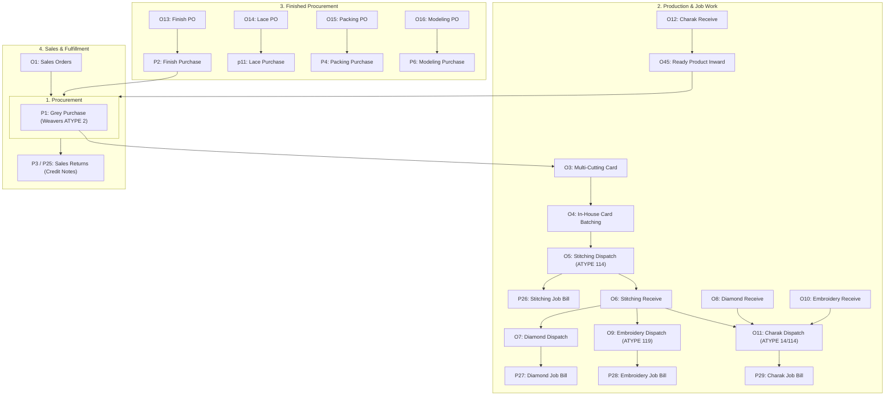
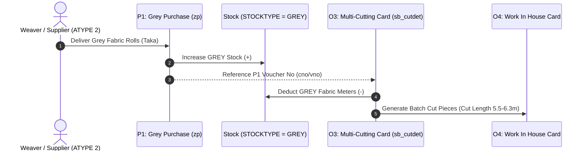
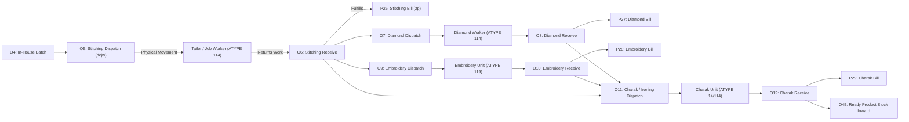
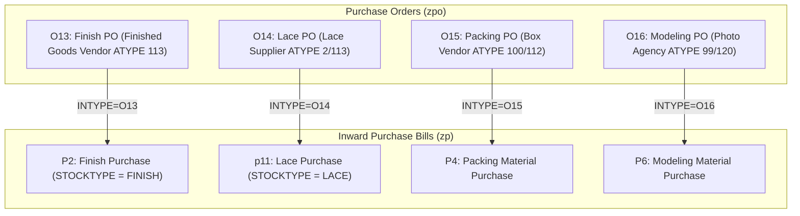
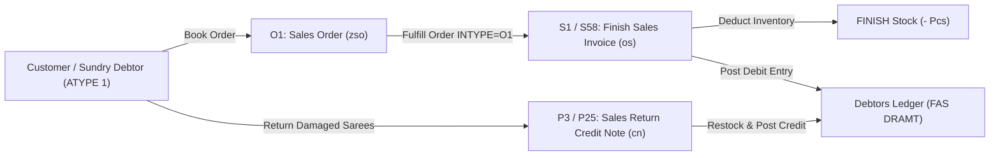
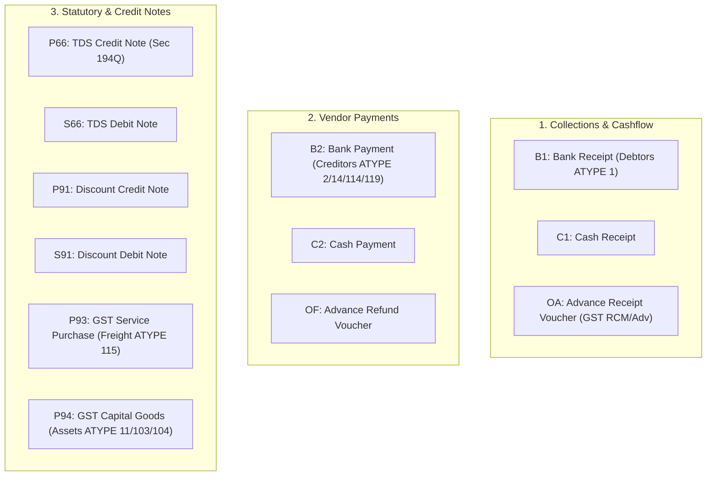

# Ambaji Sarees ERP — Master Legacy Architecture & Business Domain Guide

> **Schema Context**: Postgres 17 (`IMMBE2627` Schema)  
> **Legacy System**: AMAZE MSSQL $\rightarrow$ Airbyte Read-Only Mirror (`sq_` tables) $\rightarrow$ Supabase FY 26-27  
> **Key Database Contract**: All header-detail joins **MUST** include `CNO = DETAIL.CNO AND VNO = DETAIL.VNO AND TYPE = DETAIL.TYPE`. Pendency rules evaluate to `CLOSED IS NULL OR CLOSED = '' OR CLOSED = 'N'`. Fiscal queries force `VNO < 100000`.

---

## Executive Overview

This master reference maps the end-to-end business domain of Ambaji Sarees ERP, detailing how account types (`sq_ATYPE`), voucher series (`sq_SERIES`), stock movements (`STOCKTYPE`), and party roles intersect. Vouchers chain dynamically using `INTYPE` (input source voucher series) and `OUTTYPE` (downstream target voucher series) attributes, creating an unbroken audit trail from raw grey fabric purchases to finished saree sales.

---

## Part 1: Account Types Master (`sq_ATYPE`)

`sq_ATYPE` defines the grouping logic for all accounts in the general ledger and party dropdown search filters in the UI.

### Letter Filter Conventions
- `LETTER = 'C'`: Customer / Sundry Debtors (Used in Sales, Booking, Collection UI).
- `LETTER = 'S'`: Grey Suppliers / Weavers (Used in Grey Purchases, Weaving Orders).
- `LETTER = 'M'`: Dyeing & Processing Mills (Used in Mill Outward, Printing Recipes, Processing Charges).
- `LETTER = 'H'`: General Creditors / Job Workers / Service Partners.
- `LETTER = 'E'`: Direct & Indirect Expenses.
- `LETTER = 'G'`: Cash / Sales / Stock Accounts.
- `LETTER = 'L'`: Loans & Capital Accounts.
- `LETTER = 'B'`: Commission Brokers & Agents.
- `LETTER = 'P'`: Packaging & Staff Accounts.
- `LETTER = 'O'`: Modeling & Catalog Material Suppliers.

### Complete `sq_ATYPE` Dictionary (42 Types)

| ATYPE | Name | Letter | Primary Role & Party Type | Target UI Modules & Vouchers |
| :---: | :--- | :---: | :--- | :--- |
| **1** | `SUNDRY DEBTORS` | `C` | Saree Wholesale/Retail Customers | Sales Orders (`O1`), Finish Sales (`S1`, `S58`), Cash Sales (`S4`), Receipts (`B1`, `C1`) |
| **2** | `CREDITORS FOR GREY` | `S` | Weavers & Grey Fabric Suppliers | Grey Purchase (`P1`), Grey Returns (`S2`), Payments (`B2`, `C2`) |
| **3** | `TRADING INCOMES` | `I` | Secondary Trading Income | Journal Vouchers (`J2`) |
| **4** | `P & L EXPENSES` | `E` | General Administration Overheads | Expense Bills (`E1`), Payments (`B2`, `C2`) |
| **5** | `BANK` | `H` | Bank Accounts | Bank Receipts (`B1`), Bank Payments (`B2`), Advance Vouchers (`OA`, `OF`) |
| **6** | `CASH` | `G` | Cash in Hand | Cash Receipts (`C1`), Cash Payments (`C2`), Cash Sales (`S4`) |
| **7** | `SALE` | `G` | General Sales Ledger | Finish Sales (`S1`), Multi-Sales (`S58`), Cash Sales (`S4`) |
| **8** | `PURCHASE` | `G` | General Purchase Ledger | Finish Purchase (`P2`), Grey Purchase (`P1`) |
| **9** | `LOANS` | `L` | Bank Loans & Credit Lines | Bank Vouchers (`B1`, `B2`) |
| **10** | `TRADING EXPENSES` | `E` | Freight, Cartage, Loading Charges | Purchase Bills, Journal Vouchers |
| **11** | `FIXED ASSETS` | `F` | Plant, Machinery, Property | Capital Goods Purchases (`P94`) |
| **12** | `CREDITORS FOR BROKERAGE` | `B` | Sales Brokers & Agents | Commission Bills (`P76`), Commission JVs (`V5`) |
| **13** | `CAPITAL A/C` | `L` | Partner Capital Accounts | Journal Vouchers (`J2`) |
| **14** | `CREDITORS FOR DYEING JOB CHARG` | `M` | Dyeing, Printing & Processing Mills | Mill Receipts (`sq_MILLREC`), Mill Charges (`J1`), Charak Bills (`P29`) |
| **15** | `MILL-EXCISE` | `X` | Excise Statutory Ledger | Statutory Vouchers |
| **17** | `STAFF` | `P` | Permanent Staff Salaries | Payroll Vouchers, Cash Payments (`C2`) |
| **18** | `INVESTMENTS(APPLIED)` | `I` | Business Investments | Journal Vouchers (`J2`) |
| **19** | `PROV. FOR TAX` | `I` | Income Tax Provision | Statutory Vouchers |
| **20** | `LOANS AND ADVANCES` | `I` | Supplier & Employee Advances | Advance Receipts/Refunds (`OA`, `OF`) |
| **21** | `UNSECURED LOANS` | `L` | Private Unsecured Borrowings | Bank Vouchers (`B1`, `B2`) |
| **22** | `RESERVES AND SURPLUS` | `R` | Retained Earnings | Year-End Closing (`V3`) |
| **23** | `CLOSING STOCK` | `X` | Inventory Valuation Account | Trading Account Closing (`V2`) |
| **98** | `STAFF ADVANCE` | `S` | Salary Advances to Staff | Cash Payments (`C2`), Bank Payments (`B2`) |
| **99** | `MODELLING PHOTO MATERIAL` | `O` | Photo Props & Studio Material | Modeling Purchase (`P6`) |
| **100**| `PACKING MATERIAL` | `P` | Box, Cover, Label Inventory | Packing Purchase (`P4`) |
| **102**| `OPENING STOCK` | `G` | Financial Year Opening Stock | Stock Opening Entries (`O44`) |
| **103**| `VEHICLES` | `F` | Commercial Delivery Vehicles | Fixed Asset Purchase (`P94`) |
| **104**| `FURNITURE OF OFFICE` | `F` | Showroom & Office Furniture | Fixed Asset Purchase (`P94`) |
| **105**| `CREDITORS FOR OTHERS` | `H` | Sundry Vendors | Expense Bills (`E1`) |
| **106**| `CREDITORS FOR EXPENSES` | `H` | Utility & Service Creditors | Expense Payments |
| **107**| `P & L INCOMES` | `P` | Miscellaneous Profit & Loss Income | Journal Vouchers (`J2`) |
| **108**| `PREPAID EXPENSES` | `P` | Prepaid Insurance/Rent | Adjustment JVs (`J2`) |
| **109**| `SECURED LOAN` | `H` | Mortgages & Bank Term Loans | Bank Vouchers (`B1`, `B2`) |
| **110**| `TDS` | `T` | Tax Deducted at Source Ledger | TDS Debit/Credit Notes (`P66`, `S66`, `T1`) |
| **112**| `CREDITORS FOR PACKING MAT.` | `H` | Packaging Box & Polybag Vendors | Packing Orders (`O15`), Packing Purchases (`P4`) |
| **113**| `CREDITORS FOR GOODS` | `H` | General Finished Goods Vendors | Finish PO (`O13`), Finish Purchase (`P2`) |
| **114**| `CREDITORS FOR JOBWORK` | `H` | Stitching Job Workers & Tailors | Stitching Dispatches (`O5`, `O6`), Stitching Bills (`P26`) |
| **115**| `CREDITORS FOR SERVICES` | `H` | Freight & Transporter Agencies | GST Service Purchases (`P93`) |
| **116**| `DEBTORS FOR OTHERS` | `H` | Non-Trading Debtors | Receivables (`B1`, `C1`) |
| **117**| `SHARE APPLICATION` | `H` | Share Capital Deposits | Bank Vouchers |
| **118**| `SHREE GANESHJI MAHARAJ` | `H` | Auspicious Opening Ledger | Opening Vouchers (`00`) |
| **119**| `CREDITORS FOR EMB.JOB CHARGE` | `H` | Embroidery & Coding Job Workers | Embroidery Dispatches (`O9`, `O10`), Embroidery Bills (`P28`) |
| **120**| `CREDITORS FOR MODELING` | `H` | Models, Photographers & Designers | Modeling Orders (`O16`), Modeling Purchases (`P6`) |

---

## Part 2: Voucher Series Master (`sq_SERIES`)

`sq_SERIES` defines every transaction type in the system, configuring document headers, stock movements, and ledger bindings.

### Complete `sq_SERIES` Dictionary (60+ Series Codes)

| Series Code | Series Name | Doc Type | Stock Type | INTYPE | OUTTYPE | Account Code Binding (`acCODE`) | Business Description |
| :---: | :--- | :---: | :---: | :---: | :---: | :--- | :--- |
| **00** | `OPENING BALANCE` | - | - | - | - | `OPENING BALANCE` | Financial Year Opening Ledger Entries |
| **B1** | `BANK RECEIPT` | - | - | - | - | - | Customer Bank Payments & NEFT/RTGS Receipts |
| **B2** | `BANK PAYMENT` | - | - | - | - | - | Supplier & Vendor Bank Payments |
| **C1** | `CASH RECEIPT` | - | - | - | - | `CASH A/C` | Counter Cash Inflows |
| **C2** | `CASH PAYMENT` | - | - | - | - | `CASH A/C` | Petty Cash Outflows & Local Expense Payments |
| **E1** | `EXPENSES` | - | - | - | - | - | Administrative & Utility Expense Vouchers |
| **E2** | `EXCISE` | - | - | - | - | `EXCISE A/C` | Legacy Excise Vouchers |
| **J1** | `JOB WORK` | `zp` | - | - | - | `MILL JOB CHARGES A/C` | Dyeing Mill Processing Charges Ledger Entry |
| **J2** | `JOURNAL` | - | - | - | - | - | General Accounting Journal Adjustments |
| **O** | `WORK DESP ALL` | - | - | - | - | - | Master Dispatch Summary View |
| **O1** | `SALES ORDERS` | `zso` | - | `S1` | `S1` | - | Wholesale & Retail Customer Sales Booking |
| **O3** | `MULTI-CUTTING CARD` | - | - | - | `O4` | - | Splitting Grey Fabric Rolls into Cut Saree Pieces |
| **O4** | `WORK IN HOUSE CARD` | - | - | `O3` | - | - | In-House Batch Assembly & Tagging |
| **O5** | `WORK DESP STITCHING CHALLAN` | `dcjw` | - | `O4` | `O6` | - | Dispatch Cut Sarees to Stitching Tailors |
| **O6** | `WORK REC STITCHING CHALLAN` | - | - | `O5` | `O15` | - | Receive Stitched Sarees from Tailors |
| **O7** | `WORK DESP DIAMOND CHALLAN` | `dcjw` | - | `O6` | `O8` | - | Dispatch Sarees for Diamond/Rhinestone Work |
| **O8** | `WORK REC DIAMOND CHALLAN` | - | - | `O7` | `P27` | - | Receive Diamond-Studded Sarees |
| **O9** | `WORK DESP EMB CHALLAN` | `dcjw` | - | `O6` | `O10` | - | Dispatch Sarees to Embroidery Unit |
| **O10**| `WORK REC EMB CHALLAN` | - | - | `O9` | `P28` | - | Receive Embroidered Sarees |
| **O11**| `WORK DESP CHARAK CHALLAN` | `dcjw` | - | `O6` | `O12` | - | Dispatch Sarees for Charak / Ironing / Pressing |
| **O12**| `WORK REC CHARAK CHALLAN` | - | - | `O11` | `P29` | - | Receive Pressed & Finished Sarees |
| **O13**| `FINISH PURCHASE ORDER` | `zpo` | - | - | `P2` | - | Purchase Order for Ready Finished Sarees |
| **O14**| `LACE PURCHASE ORDER` | `zpo` | - | - | `p11` | - | Purchase Order for Lace & Border Attachments |
| **O15**| `PACKING MATERIAL ORDER` | `zpo` | - | - | `P4` | - | Purchase Order for Saree Boxes & Polybags |
| **O16**| `MODELLING ORDER` | `zpo` | - | - | `P6` | - | Purchase Order for Model Photoshoots & Posters |
| **O41**| `STOCK TRANSFER` | - | `WORK` | - | - | - | Inter-Department Stock Transfers |
| **O42**| `GODOWN TRANSFER` | - | `WORK` | - | - | - | Transfer Stock Between Godowns/Warehouses |
| **O43**| `GODOWN INWARD` | - | `WORK` | - | - | - | Warehouse Inward Voucher |
| **O44**| `OPENING STOCK (FINISH)` | - | `OTHER` | - | - | - | Stock Opening Inventory Addition |
| **O45**| `READY PRODUCT` | - | `WORK` | `O12` | - | - | Final Stock Inward of Processed Sarees |
| **OA** | `ADVANCE RECEIPT VOUCHER` | `rv` | - | - | - | - | Customer Advance Receipts (GST Compliant) |
| **OF** | `ADVANCE REFUND VOUCHER` | `rfv` | - | - | - | - | Advance Refund Payments to Customers |
| **OR** | `REVERSE CHARGE SALES TO SELF` | `is` | - | - | - | - | Reverse Charge Mechanism (RCM) Internal Invoice |
| **P** | `PURCHASES (ALL)` | - | - | - | - | - | Master Purchase Aggregator View |
| **P1** | `GREY PURCHASE` | `zp` | `GREY` | - | - | `GREY PURCHASE` | Inward Raw Fabric Purchase from Weavers (`ATYPE 2`) |
| **p11**| `LACE PURCHASE` | `zp` | `LACE` | `O14` | - | `LACE+BLOUSE+MATERIAL PURCHASE` | Inward Lace, Border & Blouse Material Purchase |
| **P2** | `FINISH PURCHASE` | `zp` | `FINISH` | `O13` | - | `FINISH PURCHASE` | Inward Ready-Made Saree Purchases |
| **P25**| `SALES GOODS RETURN (BYMISTEK)`| `cn` | `FINISH` | - | - | `SALES RETURN` | Sales Credit Note (System Correction Entry) |
| **P26**| `WORK REC STITCHING BILLS` | `zp` | - | `O6` | - | `WORK JOB CHARGES` | Financial Job Charges Bill for Stitching (`ATYPE 114`) |
| **P27**| `WORK REC DIAMOND BILLS` | `zp` | - | `O8` | - | `WORK JOB CHARGES` | Financial Job Charges Bill for Diamond Work |
| **P28**| `WORK REC EMB BILLS` | `zp` | - | `O10` | - | `WORK JOB CHARGES` | Financial Job Charges Bill for Embroidery (`ATYPE 119`) |
| **P29**| `WORK REC CHARAK BILLS` | `zp` | - | `O12` | - | `WORK JOB CHARGES` | Financial Job Charges Bill for Charak/Finishing |
| **P3** | `SALES GOODS RETURN` | `cn` | `FINISH` | - | - | `SALES RETURN` | Customer Goods Return Credit Note |
| **P32**| `FINISH TOP DYED` | `zp` | `FINISH` | - | - | `FINISH PURCHASE` | Top-Dyed Finished Fabric Purchase |
| **P4** | `PACKING MATERIAL` | `zp` | - | `O12` | - | `PACKING MATERIAL PURCHASE` | Packaging Material Purchase Inward (`ATYPE 100/112`) |
| **P5** | `WORK REC. BILL (OLD)` | `zp` | `WORK` | - | - | `WORK JOB CHARGES` | Legacy Job Work Bill Entry |
| **P6** | `MODELLING PHOTO MATERIALS` | `zp` | - | `P6` | - | `MODELLING PHOTO MATERIALS` | Photoshoot, Banner & Catalog Material Purchase |
| **P66**| `CREDIT NOTE (TDS)` | - | - | - | - | `TDS RECEIVABLE A/C (194Q)` | TDS Section 194Q Credit Adjustment Note |
| **P76**| `PURCHASE BILLS (COMM)` | `zp` | - | - | - | `COMMISSION ON SALES A/C` | Sales Agent Commission Bills (`ATYPE 12`) |
| **P77**| `CREDIT NOTE (TCS)` | - | - | - | - | `TCS RECEIVABLE A/C` | TCS Credit Adjustment Note |
| **P91**| `CREDIT NOTE (ON SALES)` | `cn` | - | - | - | `DISCOUNT A/C SALES` | Post-Sale Discount Credit Note |
| **P92**| `CREDIT NOTE (ON PURCHASES)` | `zcn` | - | - | - | `DISCOUNT A/C PURCHASE` | Purchase Discount Credit Note |
| **P93**| `PURCHASE (GST INPUT SERVICES)`| `zp` | - | - | - | `PURCHASE (SERVICES)` | Inward Freight, Transport & Utility Service Bills |
| **P94**| `PURCHASE (GST CAPITAL GOODS)` | `zp` | - | - | - | `PURCHASE (CAPTIAL GOODS/ASSETS)`| Machinery, Office Furniture & Vehicle Purchases |
| **P95**| `PURCHASE (GST GENERAL GOODS)` | `zp` | - | - | - | `PURCHASE (GENERAL GOODS)` | General Store & Office Supply Purchases |
| **S** | `SALES (ALL)` | - | - | - | - | - | Master Sales Aggregator View |
| **S1** | `FINISH SALES` | `os` | `FINISH` | `O1` | - | `SALES A/C` | Primary Finished Saree Invoicing (`ATYPE 1`) |
| **S2** | `GREY PURCHASE RETURN` | `zdn` | `GREY` | - | - | `GREY PURCHASE RETURN A/C` | Debit Note for Returning Damaged Grey to Weaver |
| **S3** | `PURCHASE RETURN` | `zdn` | `FINISH` | - | - | `FINISH PURCHASE RETURN A/C` | Debit Note for Returning Finished Stock to Vendor |
| **S4** | `CASH SALES` | `os` | `FINISH` | - | - | `CASH SALES A/C` | Direct OTC Cash Sales Invoicing |
| **S5** | `GREY SALES` | `os` | `GREY` | - | - | `GREY SALES A/C` | Direct Sales of Raw Grey Fabric to Other Mills |
| **S58**| `FINISH SALES MULTY` | `os` | `FINISH` | `O1` | - | `SALES A/C` | Multi-Item Bulk Sales Invoicing (`ATYPE 1`) |
| **S6** | `FENT SALES` | `os` | - | - | - | `FENT SALES A/C` | Sales of Cut Pieces, Wastage & Fent Fabric |
| **S66**| `DEBIT NOTE (TDS)` | - | - | - | - | `TDS PAYABLE A/C (194Q)` | TDS Section 194Q Debit Adjustment Note |
| **S77**| `DEBIT NOTE (TCS)` | - | - | - | - | `TCS PAYABLE A/C` | TCS Debit Adjustment Note |
| **S91**| `DEBIT NOTE (ON SALES)` | `dn` | - | - | - | `DISCOUNT A/C SALES` | Debit Note for Rate Differences / Interest |
| **S92**| `DEBIT NOTE (ON PURCHASES)` | `zdn` | - | - | - | `DISCOUNT A/C PURCHASE` | Debit Note to Supplier for Rate Mismatch |
| **T1** | `TDS` | - | - | - | - | - | Direct Statutory TDS Ledger Adjustments |
| **V1** | `VATAV` | - | - | - | - | - | Cash Discount Ledger Adjustments |
| **V2** | `CLOSING ENTRIES (TRADING)` | - | - | - | - | - | Trading Account Stock Closing Journal |
| **V3** | `CLOSING ENTRIES (P & L)` | - | - | - | - | - | Profit & Loss Account Year-End Closing Journal |
| **V4** | `VAT JV` | - | - | - | - | - | Legacy Tax Adjustments |
| **V5** | `COMMISSION JVS` | - | - | - | - | - | Brokerage & Commission Provision Journals |
| **XX**| `UNADJ PAYMENT` | - | - | - | - | - | Unadjusted On-Account Advances |

---

## Part 3: End-to-End Data Flow Pipelines & Voucher Chaining

### Pipeline 1: Procurement & Raw Grey Stock Inward Flow

1. **P1 (Grey Purchase)**: Inward bulk grey fabric from Weaver (`sq_MASTER` where `ATYPE = 2`). Increases `STOCKTYPE = 'GREY'`.
2. **O3 (Multi-Cutting Card)**: Bulk grey rolls are split into cut saree lengths (`sb_cutdet` / `sb_cutdet_summary`). Deducts `GREY` meters and calculates yield %:
   $$\text{Fresh Yield \%} = \frac{\text{Fresh Cut Pcs} \times \text{Cut Length}}{\text{Total Received Grey Meters}} \times 100$$
3. **O4 (Work In House Card)**: Groups cut saree pieces into in-house work batches ready for job work dispatches.

---

### Pipeline 2: Multi-Stage Production & Job Work Lifecycle

#### Step 2.1: Stitching & Border Attachment
- **Dispatch (`O5`)**: Issue cut pieces to Tailor (`ATYPE = 114`). Document type = `dcjw` (Challan Job Work).
- **Receive (`O6`)**: Receive stitched sarees from Tailor (`INTYPE = 'O4'`, `OUTTYPE = 'O6'`).
- **Financial Bill (`P26`)**: Financial voucher crediting tailor account (`ATYPE = 114`) for stitching job rate (₹/pc).

#### Step 2.2: Value Addition (Diamond & Rhinestone Work)
- **Dispatch (`O7`)**: Issue stitched sarees for diamond studding (`INTYPE = 'O6'`).
- **Receive (`O8`)**: Receive diamond-studded sarees (`OUTTYPE = 'P27'`).
- **Financial Bill (`P27`)**: Financial voucher crediting diamond worker (`ATYPE = 114`).

#### Step 2.3: Embroidery & Coding Work
- **Dispatch (`O9`)**: Issue sarees to Embroidery unit (`ATYPE = 119`).
- **Receive (`O10`)**: Receive embroidered sarees (`OUTTYPE = 'P28'`).
- **Financial Bill (`P28`)**: Financial voucher crediting embroidery unit (`ATYPE = 119`).

#### Step 2.4: Charak, Ironing & Final Packaging
- **Dispatch (`O11`)**: Issue sarees for Charak/pressing (`INTYPE = 'O6'`, `OUTTYPE = 'O12'`).
- **Receive (`O12`)**: Receive finished & pressed sarees.
- **Financial Bill (`P29`)**: Financial voucher crediting Charak mill (`ATYPE = 14` or `114`).
- **Stock Addition (`O45`)**: Converts work-in-progress (`STOCKTYPE = 'WORK'`) into ready finished saree inventory (`STOCKTYPE = 'FINISH'`).

---

### Pipeline 3: Purchase Orders & Finished Goods Procurement

---

### Pipeline 4: Sales Booking, Invoicing & Returns

---

### Pipeline 5: Financial Ledger, GST & Adjustment Vouchers

---

## Part 4: Account Type (`sq_ATYPE`) to Series (`sq_SERIES`) Interaction Matrix

| Series Code | Series Name | Permitted Account Types (`sq_ATYPE`) | Target Role / Party Type |
| :---: | :--- | :--- | :--- |
| **P1** | `GREY PURCHASE` | `2` (`CREDITORS FOR GREY`) | Weavers & Grey Fabric Merchants |
| **O3** | `MULTI-CUTTING CARD` | `14` (`DYEING MILLS`) | Processing Mills & Printing Houses |
| **O5 / O6** | `STITCHING DISPATCH / REC` | `114` (`CREDITORS FOR JOBWORK`) | Stitching Tailors & Assembly Units |
| **P26** | `STITCHING JOB BILL` | `114` (`CREDITORS FOR JOBWORK`) | Stitching Tailors & Assembly Units |
| **O7 / O8** | `DIAMOND DISPATCH / REC` | `114` (`CREDITORS FOR JOBWORK`) | Diamond & Rhinestone Handcrafters |
| **P27** | `DIAMOND JOB BILL` | `114` (`CREDITORS FOR JOBWORK`) | Diamond & Rhinestone Handcrafters |
| **O9 / O10**| `EMB DISPATCH / REC` | `119` (`EMBROIDERY JOB CHARGE`) | Schiffli & Multi-Head Embroidery Units |
| **P28** | `EMBROIDERY JOB BILL` | `119` (`EMBROIDERY JOB CHARGE`) | Schiffli & Multi-Head Embroidery Units |
| **O11 / O12**| `CHARAK DISPATCH / REC` | `14` (`DYEING MILLS`), `114` (`JOBWORK`) | Charak, Ironing & Steam Press Units |
| **P29** | `CHARAK JOB BILL` | `14` (`DYEING MILLS`), `114` (`JOBWORK`) | Charak, Ironing & Steam Press Units |
| **O13 / P2**| `FINISH PO / PURCHASE` | `113` (`CREDITORS FOR GOODS`), `2` | Finished Saree Wholesalers & Manufacturers |
| **O14 / p11**| `LACE PO / PURCHASE` | `2` (`GREY`), `113` (`GOODS`) | Border, Lace & Piping Manufacturers |
| **O15 / P4**| `PACKING PO / PURCHASE` | `100` (`PACKING`), `112` (`PACKING CRED`) | Box, Polybag & Tag Vendors |
| **O16 / P6**| `MODELLING PO / PURCHASE`| `99` (`MODELLING MAT`), `120` (`MODELING CRED`) | Photographers, Models & Design Studios |
| **O1 / S1** | `SALES ORDER / FINISH SALES`| `1` (`SUNDRY DEBTORS`) | Saree Wholesale Buyers & Retail Outlets |
| **S4** | `CASH SALES` | `1` (`DEBTORS`), `6` (`CASH`) | Counter Cash Sale Customers |
| **S5** | `GREY SALES` | `1` (`DEBTORS`), `2` (`GREY CRED`) | Grey Fabric Traders & Processing Houses |
| **P3 / P25**| `SALES RETURNS` | `1` (`SUNDRY DEBTORS`) | Customers Returning Goods |
| **S2 / S3** | `PURCHASE RETURNS` | `2` (`GREY`), `113` (`GOODS`) | Suppliers Receiving Returned Goods |
| **B1 / C1** | `BANK / CASH RECEIPT` | `1` (`DEBTORS`), `116` (`OTHER DEBTORS`) | Customers Paying Receivables |
| **B2 / C2** | `BANK / CASH PAYMENT` | `2`, `14`, `100`, `112`, `113`, `114`, `119`, `120` | Suppliers & Job Workers Receiving Payments |
| **P76** | `COMMISSION BILLS` | `12` (`CREDITORS FOR BROKERAGE`) | Sales Agents & Brokers |
| **P93** | `GST SERVICE PURCHASES` | `115` (`CREDITORS FOR SERVICES`) | Transport Agencies & Freight Carriers |
| **P94** | `GST CAPITAL GOODS` | `11` (`FIXED ASSETS`), `103` (`VEHICLES`) | Asset & Machinery Vendors |

---

## Architectural & Integration Summary

1. **Airbyte Sync Safety**: `sq_` tables are **read-only mirrors**. Never write directly to `sq_` tables or alter schemas.
2. **Transactional Edge Functions**: Batch transactional writes use Supabase Edge Functions (`_db.client.functions.invoke(...)`).
3. **Data Integrity**: Always include composite keys (`CNO`, `VNO`, `TYPE`) on header-detail joins to prevent fan-out duplicate rows.
