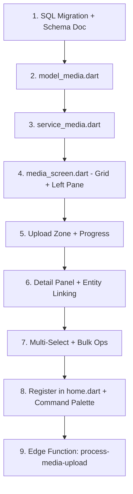

# Plan 01: Media Library — Central File Management Hub

> **Status**: 🟡 Draft — Open questions pending  
> **Priority**: High (daily operational use by team)  
> **Route**: Home Index 3 (replacing "Design Catalog" placeholder)  
> **Estimated Complexity**: Large (new infrastructure + UI + backend)

---

## 1. Business Context

Every day, the Ambaji Sarees team generates **hundreds of photos and documents** across the production lifecycle:

### Sales Media
- **Set Pic** — Styled photo of the saree on a mannequin/display
- **Poster Pic** — Marketing-ready image for catalog/WhatsApp distribution
- **Poster PDF** — Designed poster with pricing/quality details
- **Video** — Short product showcase clips

### Production Media  
- **Mill Programming Pics** — Raw images taken during loom/programming setup at mills
- **Cutting Card Pic (Front & Back)** — Physical cutting card scans for each batch
- **Raw Matching Pic** — Color/pattern matching references
- **Job Card Pic** — Job work tracking card scans
- **Sample Pic** — First article / prototype photos
- **Recipe Pic** — Dye/chemical recipe documentation
- **Completion Guide** — Final QC reference images

### Billing & Purchases
- **Bill Scans** — Supplier invoices, processor bills (P1, P26–P29)
- **Challan Scans** — Dispatch/receive challans (O5, O6, O7–O12)
- **Delivery Receipts** — Transport/logistics proof

### The Problem
Currently these files live scattered across WhatsApp groups, phone galleries, and local folders. There is no single searchable repository linking media to business entities (sarees, cutting batches, job cards, bills). This module creates that central hub.

---

## 2. Storage Architecture

### Phase 1 (Now → 500GB): Supabase Storage
Supabase Storage is S3-backed and already integrated with our auth system. Flutter SDK provides native `supabase.storage.from('bucket').upload()` with progress callbacks.

**Cost at scale:**
| Volume | Storage Cost/mo | Egress (internal team, est. 2x reads) |
|--------|----------------|---------------------------------------|
| 100 GB | ~$2.10 | ~$18/mo |
| 300 GB | ~$6.30 | ~$54/mo |
| 500 GB | ~$10.50 | ~$90/mo |

### Phase 2 (500GB+ or customer-facing catalog): Cloudflare R2
Migrate large assets (videos, high-res posters) to R2 for **zero egress fees**. Keep metadata in Postgres. Generate signed URLs via Supabase Edge Function to maintain auth.

### Thumbnail & Optimization Strategy
- **Supabase Image Transformations** for on-the-fly resizing (append `?width=200&height=200` to public URL)
- **Edge Function** `process-media-upload` to run on upload:
  1. Generate a 200px thumbnail and store as `{path}/thumb_{filename}`
  2. Create a compressed WebP version for fast grid loading
  3. Extract EXIF metadata (date taken, GPS if available)
  4. Update `sb_media` row with dimensions, thumbnail path, and file size

---

## 3. Database Schema

### 3.1 Metadata Table: `IMMBE2627.sb_media`

```sql
CREATE TABLE "IMMBE2627".sb_media (
    id UUID DEFAULT gen_random_uuid() PRIMARY KEY,
    
    -- File Identity
    file_path TEXT NOT NULL,              -- Storage path: 'sales/DANI-001/set_pic/img_001.jpg'
    file_name TEXT NOT NULL,              -- Original upload name
    display_name TEXT,                    -- Renamed display name (after entity linking)
    file_size BIGINT NOT NULL DEFAULT 0,  -- Bytes
    mime_type TEXT NOT NULL,              -- 'image/jpeg', 'video/mp4', 'application/pdf'
    width INT,                           -- Image/video width in px
    height INT,                          -- Image/video height in px
    duration_seconds NUMERIC,            -- Video duration
    
    -- Categorization
    bucket TEXT NOT NULL DEFAULT 'general',  -- 'sales', 'production', 'billing', 'general'
    media_type TEXT,                      -- Specific type within category (see enum below)
    tags TEXT[] DEFAULT '{}',             -- Free-form searchable tags
    
    -- Entity Linkage (nullable — files can be unlinked initially)
    entity_type TEXT,                     -- 'quality', 'cutting_batch', 'bill', 'job_card', 'challan', 'grey_purchase'
    entity_id TEXT,                       -- The business key (qcode, MULTI_VNO, VNO_TYPE, CARDNO)
    entity_label TEXT,                    -- Human-readable label cached for display ('DANI 5.5m', 'Batch #84')
    is_linked BOOLEAN DEFAULT FALSE,     -- Quick filter: linked vs unlinked (unsorted)
    
    -- Thumbnails & Variants
    thumb_path TEXT,                      -- Path to auto-generated thumbnail
    compressed_path TEXT,                 -- Path to WebP compressed version
    
    -- Audit
    uploaded_by UUID REFERENCES auth.users(id),
    uploader_name TEXT,                  -- Cached username from sb_APP_PROFILES
    linked_by UUID REFERENCES auth.users(id),
    linked_at TIMESTAMPTZ,
    created_at TIMESTAMPTZ DEFAULT NOW(),
    updated_at TIMESTAMPTZ DEFAULT NOW(),
    
    -- Soft delete
    is_archived BOOLEAN DEFAULT FALSE,
    archived_at TIMESTAMPTZ
);

-- Indexes for fast filtering
CREATE INDEX idx_sb_media_bucket ON "IMMBE2627".sb_media(bucket);
CREATE INDEX idx_sb_media_entity ON "IMMBE2627".sb_media(entity_type, entity_id);
CREATE INDEX idx_sb_media_linked ON "IMMBE2627".sb_media(is_linked);
CREATE INDEX idx_sb_media_type ON "IMMBE2627".sb_media(media_type);
CREATE INDEX idx_sb_media_tags ON "IMMBE2627".sb_media USING GIN(tags);
CREATE INDEX idx_sb_media_created ON "IMMBE2627".sb_media(created_at DESC);
```

### 3.2 Media Type Enum Values

| Bucket | `media_type` Values |
|--------|-------------------|
| **sales** | `set_pic`, `poster_pic`, `poster_pdf`, `video` |
| **production** | `mill_programming`, `cutting_card_front`, `cutting_card_back`, `raw_matching`, `job_card`, `sample`, `recipe`, `completion_guide` |
| **billing** | `bill_scan`, `challan_scan`, `delivery_receipt` |
| **general** | `other` (default for unsorted uploads) |

### 3.3 Supabase Storage Buckets

```
ambaji-media/                        ← Single bucket, organized by path prefix
├── sales/{qcode}/
│   ├── set_pic/
│   ├── poster/
│   ├── pdf/
│   └── video/
├── production/
│   ├── cutting/{MULTI_VNO}/         ← front.jpg, back.jpg
│   ├── jobcard/{VNO}_{TYPE}/
│   ├── recipe/{qcode}/
│   ├── sample/{qcode}/
│   ├── mill/{CARDNO}/
│   └── matching/{qcode}_{shade}/
├── billing/
│   └── {TYPE}_{VNO}_{CNO}/
├── general/                         ← Unsorted uploads land here
│   └── {YYYY-MM-DD}/{original_filename}
└── thumbs/                          ← Auto-generated thumbnails mirror the above structure
```

### 3.4 RLS Policies

```sql
-- All authenticated team members can read all media
CREATE POLICY "Team can read all media" ON "IMMBE2627".sb_media
    FOR SELECT USING (auth.role() = 'authenticated');

-- All authenticated team members can upload
CREATE POLICY "Team can insert media" ON "IMMBE2627".sb_media
    FOR INSERT WITH CHECK (auth.role() = 'authenticated');

-- Only uploader or admin can delete
CREATE POLICY "Uploader can delete own media" ON "IMMBE2627".sb_media
    FOR DELETE USING (uploaded_by = auth.uid());

-- Future: Public read for sales bucket (customer catalog)
-- CREATE POLICY "Public can read sales media" ON "IMMBE2627".sb_media
--     FOR SELECT USING (bucket = 'sales' AND is_linked = TRUE);
```

---

## 4. UI Design — Media Library Page

### 4.1 Page Layout (Three-Zone Split)

```
┌─────────────────────────────────────────────────────────────────┐
│  OrganPaneHeader: "Media Library"  [Search] [Upload ▲] [⋮ Menu]│
├──────────────┬──────────────────────────────────────────────────┤
│              │                                                  │
│  LEFT PANE   │              MAIN CONTENT AREA                   │
│  (280px)     │                                                  │
│              │  ┌──────┐ ┌──────┐ ┌──────┐ ┌──────┐           │
│  Buckets     │  │      │ │      │ │      │ │      │           │
│  ┌─────────┐ │  │ thumb│ │ thumb│ │ thumb│ │ thumb│           │
│  │📁 All    │ │  │      │ │      │ │      │ │      │           │
│  │📁 Sales  │ │  └──────┘ └──────┘ └──────┘ └──────┘           │
│  │📁 Prod   │ │  ┌──────┐ ┌──────┐ ┌──────┐ ┌──────┐           │
│  │📁 Billing│ │  │      │ │      │ │      │ │      │           │
│  │📁 General│ │  │ thumb│ │ thumb│ │ thumb│ │ thumb│           │
│  └─────────┘ │  │      │ │      │ │      │ │      │           │
│              │  └──────┘ └──────┘ └──────┘ └──────┘           │
│  Filters     │                                                  │
│  ┌─────────┐ │  ┌──────────────────────────────────┐           │
│  │ Type  ▼ │ │  │  📤 DRAG & DROP ZONE             │           │
│  │ Date  ▼ │ │  │  Drop files here or click to      │           │
│  │ Linked ▼│ │  │  browse. Supports bulk upload.     │           │
│  │ Entity ▼│ │  └──────────────────────────────────┘           │
│  └─────────┘ │                                                  │
│              │  [Pagination: 1 2 3 ... 50]   Showing 200/4,521 │
├──────────────┴──────────────────────────────────────────────────┤
│  Status Bar: "12 files uploading... (3.2 GB) ████████░░ 78%"   │
└─────────────────────────────────────────────────────────────────┘
```

### 4.2 Upload Flow

1. **Drag & Drop Zone** — Always visible at the bottom of the grid (or toggled via Upload button). Accepts multiple files.
2. **Bucket Selection** — Before upload starts, user picks a target bucket (`Sales`, `Production`, `Billing`, or `General`). Default: `General`.
3. **Optional Media Type** — If bucket is selected, show relevant type chips (e.g., selecting `Production` shows: `Cutting Card Front`, `Cutting Card Back`, `Recipe`, etc.)
4. **Optional Entity Link** — Autocomplete field to link to a quality, cutting batch, or bill. Can be skipped (file goes to "Unsorted").
5. **Bulk Progress** — Bottom status bar shows aggregate upload progress with individual file indicators.
6. **Post-Upload** — Files appear in the grid immediately. Unlinked files get a yellow "Unsorted" badge.

### 4.3 Grid View (Main Content)

- **Responsive grid** of thumbnail cards (4–6 columns depending on window width)
- Each card shows: thumbnail, file name, type badge, entity link badge (or "Unsorted"), file size, upload date
- **Click** → Opens detail panel (right side or modal):
  - Full-size preview (images), PDF viewer (PDFs), video player (videos)
  - Metadata: dimensions, size, uploader, upload date
  - Entity linking controls (autocomplete to link/re-link)
  - Rename field
  - Tags editor
  - Delete button (soft delete → archive)
- **Multi-select** mode (checkbox on hover, Ctrl+Click, Shift+Click) for bulk operations:
  - Bulk assign to bucket
  - Bulk link to entity
  - Bulk tag
  - Bulk delete/archive

### 4.4 Sort & Filter

- **Bucket filter** (left pane tree navigation)
- **Media type filter** (dropdown in left pane)
- **Linked/Unlinked toggle** — Critical for the "sorting" workflow (person 2 goes through unlinked files)
- **Date range picker**
- **Entity search** — "Show all media linked to quality DANI" or "cutting batch 84"
- **Sort by**: Upload date (default), File name, File size, Entity

### 4.5 The "Sorting Workflow"

This is a first-class workflow, not an afterthought:
1. User 1 (mill/factory) bulk-uploads 200 photos into `General` bucket
2. User 2 (office) opens Media Library → filters by `Unsorted` → sees all unlinked files
3. For each file (or batch-selected group):
   - Assigns bucket (`Production`)
   - Assigns media type (`Cutting Card Front`)
   - Links to entity (autocomplete: "Batch 84" → `cutting_batch:84`)
   - File is auto-renamed to: `BATCH_84_cutting_card_front_001.jpg`
4. Sorted files disappear from the "Unsorted" view

---

## 5. Backend Components

### 5.1 Edge Function: `process-media-upload`

Triggered after a successful Supabase Storage upload (via database webhook on `sb_media` insert):

1. **Read the uploaded file** from storage
2. **If image**: Generate thumbnail (200x200), generate compressed WebP (max 1200px wide), extract dimensions
3. **If video**: Extract first frame as thumbnail, get duration
4. **If PDF**: Generate first-page thumbnail
5. **Update `sb_media`** row with: `thumb_path`, `compressed_path`, `width`, `height`, `duration_seconds`

### 5.2 Edge Function: `rename-media-file`

Called when a file is linked to an entity:

1. **Compute new path** based on bucket + entity + media_type convention
2. **Move file in storage** (copy to new path, delete old)
3. **Update `sb_media`** row with new `file_path` and `display_name`
4. **Move thumbnail** to matching thumb path

### 5.3 Service: `service_media.dart`

```dart
class MediaService {
  // Singleton pattern (standard)
  
  // -- Queries --
  Future<PaginatedResult<MediaModel>> getMedia({
    int offset, int limit,
    String? bucket,           // 'sales', 'production', 'billing', 'general'
    String? mediaType,        // 'cutting_card_front', 'poster_pic', etc.
    bool? isLinked,           // null=all, true=linked, false=unsorted
    String? entityType,       // Filter by linked entity type
    String? entityId,         // Filter by specific entity
    String? searchTerm,       // Search file names, tags, entity labels
    String sortBy,            // 'created_at_desc', 'file_name_asc', 'file_size_desc'
  });
  
  Future<MediaModel?> getMediaById(String id);
  Future<List<MediaModel>> getMediaForEntity(String entityType, String entityId);
  
  // -- Uploads --
  Future<MediaModel> uploadFile(File file, {
    String bucket = 'general',
    String? mediaType,
    String? entityType,
    String? entityId,
  });
  
  Future<List<MediaModel>> uploadBulk(List<File> files, {
    String bucket = 'general',
    String? mediaType,
  });
  
  // -- Mutations --
  Future<void> linkToEntity(String mediaId, String entityType, String entityId, String entityLabel);
  Future<void> bulkLinkToEntity(List<String> mediaIds, String entityType, String entityId, String entityLabel);
  Future<void> updateTags(String mediaId, List<String> tags);
  Future<void> moveTooBucket(String mediaId, String newBucket, String? newMediaType);
  Future<void> archiveMedia(String mediaId);
  Future<void> bulkArchive(List<String> mediaIds);
  
  // -- Signed URLs --
  Future<String> getPublicUrl(String filePath);
  Future<String> getSignedUrl(String filePath, {Duration expiry = const Duration(hours: 1)});
}
```

### 5.4 Model: `model_media.dart`

```dart
@immutable
class MediaModel {
  final String id;
  final String filePath;
  final String fileName;
  final String? displayName;
  final int fileSize;
  final String mimeType;
  final int? width;
  final int? height;
  final double? durationSeconds;
  final String bucket;
  final String? mediaType;
  final List<String> tags;
  final String? entityType;
  final String? entityId;
  final String? entityLabel;
  final bool isLinked;
  final String? thumbPath;
  final String? compressedPath;
  final String? uploaderName;
  final DateTime createdAt;
  
  // Computed getters
  bool get isImage => mimeType.startsWith('image/');
  bool get isVideo => mimeType.startsWith('video/');
  bool get isPdf => mimeType == 'application/pdf';
  String get fileSizeFormatted => _formatBytes(fileSize);
  String get bucketLabel => bucket[0].toUpperCase() + bucket.substring(1);
}
```

---

## 6. File Naming Convention (Auto-Rename on Link)

When a media file is linked to an entity, it is automatically renamed following this convention:

| Entity Type | Rename Pattern | Example |
|-------------|---------------|---------|
| Quality (Sales) | `{QCODE}_{media_type}_{seq}.{ext}` | `DANI_set_pic_001.jpg` |
| Cutting Batch | `BATCH_{MULTI_VNO}_{media_type}_{seq}.{ext}` | `BATCH_84_cutting_card_front_001.jpg` |
| Grey Purchase (P1) | `P1_{VNO}_{media_type}_{seq}.{ext}` | `P1_1042_mill_programming_001.jpg` |
| Job Card | `JC_{VNO}_{TYPE}_{media_type}_{seq}.{ext}` | `JC_25_O5_job_card_001.jpg` |
| Bill/Challan | `{TYPE}_{VNO}_{media_type}_{seq}.{ext}` | `O6_432_challan_scan_001.jpg` |

Sequence numbers (`_001`, `_002`) auto-increment per entity+type combination.

---

## 7. Integration Points with Existing Screens

Once the Media Library is built, it unlocks inline media features across existing modules:

| Screen | Integration | Priority |
|--------|-------------|----------|
| **Cutting Cards** | "Attach Photo" button in detail canvas → opens media picker or camera upload | High |
| **Job Work** | Attach challan scan to O5/O6 dispatches | Medium |
| **Grey Production** | Attach mill programming photos to P1 headers | Medium |
| **Quality Master** | Show linked sales images (set pics, posters) in detail pane | Medium |
| **Parties Master** | Attach visiting cards, shop photos | Low |

These integrations are **Phase 2** — the standalone Media Library page is Phase 1.

---

## 8. Open Questions (For Discussion)

> [!IMPORTANT]
> **Q1 — Storage Provider**: Supabase Storage for Phase 1? The cost is manageable under 500GB. R2 migration path for videos/customer-facing catalog later. **Confirm Y/N.**

> [!IMPORTANT]  
> **Q2 — Existing Archive**: Do you have an existing photo archive (local folders, Google Drive, etc.) that needs to be migrated into this system? If yes, how large approximately?

> [!IMPORTANT]
> **Q3 — Standalone vs. Inline First**: Should we build the **standalone Media Library page** first (global upload/sort/browse), and then add inline upload buttons to Cutting Cards / Job Work screens later? Or do you need inline upload somewhere immediately?

> [!WARNING]
> **Q4 — Video Processing**: Videos are the heaviest assets. Do we need server-side transcoding (compress to 720p H.264 for fast playback), or are the original files sufficient? Transcoding requires a more powerful Edge Function runtime or external service.

> [!NOTE]
> **Q5 — Navigation Slot**: Currently Index 3 in the sidebar is "Design Catalog" (placeholder). Should Media Library take this slot, or should it get a new dedicated slot?

> [!NOTE]
> **Q6 — Camera Upload (Mobile/Tablet)**: If the app runs on web, mill workers could upload directly from their phone browser camera. Should we support this in Phase 1, or is desktop-only upload sufficient?

> [!NOTE]
> **Q7 — Retention Policy**: Should we auto-archive media older than X years? Or keep everything forever? This affects long-term storage costs.

---

## 9. Acceptance Criteria (MVP)

- [ ] `sb_media` table created with indexes and RLS policies
- [ ] Supabase Storage bucket `ambaji-media` configured with folder structure
- [ ] `model_media.dart` with full `fromJson` factory
- [ ] `service_media.dart` singleton with upload, query, link, and archive methods
- [ ] Media Library screen registered at sidebar index 3
- [ ] Left pane: bucket tree + filter controls
- [ ] Main area: responsive thumbnail grid with lazy loading
- [ ] Drag-and-drop upload zone accepting multiple files
- [ ] Bucket selection before upload (default: General)
- [ ] Upload progress bar (individual + aggregate)
- [ ] Detail panel on file click: preview, metadata, entity link autocomplete, tags, rename
- [ ] Multi-select mode with bulk link/bucket/archive operations
- [ ] "Unsorted" filter view for the sorting workflow
- [ ] Auto-rename on entity link
- [ ] Edge Function for thumbnail generation on upload
- [ ] Pagination (50 items per page)
- [ ] Search by filename, tags, entity label

---

## 10. Gemini Execution Prompt

> **Copy the prompt below into a new Antigravity IDE conversation with Gemini.**  
> Before pasting, ensure Gemini has read the `/flutter` workflow.

---

````markdown
## Task: Build the Media Library Module

You are building a new **Media Library** page for the Ambaji Sarees ERP — a central repository for uploading, organizing, and managing all media files (saree photos, cutting card scans, bill images, videos, PDFs) across the business.

### Pre-Reading (MANDATORY)
Before writing any code, read these files in order:
1. `/flutter` workflow (use the slash command)
2. `docs/plans/01_media_library.md` — the full architectural plan (this document)
3. `docs/architecture_pattern_guide.md` — model/service patterns
4. `frontend/lib/screens/home.dart` — navigation structure
5. `frontend/lib/services/service_cutting.dart` — reference service pattern
6. `frontend/lib/models/model_cutting.dart` — reference model pattern

### Phase 1: Database Setup
1. Create a new schema doc at `backend/schema_docs/06_media/sb_media.md` documenting the table
2. Write the SQL migration for `IMMBE2627.sb_media` table with all columns, indexes, and RLS policies as specified in the plan (Section 3.1)
3. Apply the migration via Supabase MCP (`apply_migration`) or document it for manual execution
4. Create the Supabase Storage bucket `ambaji-media` (this may need manual dashboard setup — document the steps)

### Phase 2: Data Layer
1. Create `frontend/lib/models/model_media.dart`:
   - Immutable `MediaModel` class with full `fromJson` factory
   - Use defensive `(json['x'] as num?)?.toInt() ?? 0` patterns for all numerics
   - Include computed getters: `isImage`, `isVideo`, `isPdf`, `fileSizeFormatted`, `bucketLabel`
   - Include a `_formatBytes(int bytes)` helper (KB/MB/GB formatting)
   
2. Create `frontend/lib/services/service_media.dart`:
   - Singleton pattern matching `CuttingService`
   - `getMedia()` with pagination, filtering by bucket/mediaType/isLinked/entityType/entityId/searchTerm, and sorting
   - `uploadFile()` using `supabase.storage.from('ambaji-media').upload()` with progress callback
   - `uploadBulk()` for multiple files with aggregate progress tracking
   - `linkToEntity()` — updates `sb_media` row + triggers rename
   - `bulkLinkToEntity()` for multi-select operations
   - `updateTags()`, `moveToBucket()`, `archiveMedia()`, `bulkArchive()`
   - `getSignedUrl()` and `getPublicUrl()` for image display
   - All methods must use `.schema('IMMBE2627')` for the metadata table

### Phase 3: UI — Media Library Screen
1. Create `frontend/lib/screens/media/media_screen.dart`:
   - Register at route index 3 in `home.dart` (replace "Design Catalog" placeholder)
   - Add to command palette actions in `home.dart`

2. **Left Pane (280px)**:
   - Bucket navigation tree: All, Sales, Production, Billing, General
   - Show count badges next to each bucket
   - Filter section below: Media Type dropdown, Linked/Unlinked toggle, Date range
   
3. **Main Content Area**:
   - Responsive thumbnail grid (use `GridView.builder` with `SliverGridDelegateWithMaxCrossAxisExtent(maxCrossAxisExtent: 200)`)
   - Each grid tile: thumbnail image, file name (truncated), type badge (CellBadge), entity badge or "Unsorted" badge (yellow)
   - Hover state: show checkbox for multi-select, subtle elevation
   - Click: open detail side panel
   - Bottom: `TissuePagination` component
   
4. **Upload Zone**:
   - Drag-and-drop area using `DropTarget` (or a custom gesture detector for desktop)
   - Also accessible via "Upload" button in `OrganPaneHeader`
   - Pre-upload dialog: select bucket (required), optional media type chips, optional entity autocomplete
   - Upload progress: bottom status bar showing file count, total size, aggregate progress bar
   - On complete: auto-refresh grid, show toast notification

5. **Detail Panel** (slides in from right or replaces grid on selection):
   - Full image preview (for images), PDF thumbnail (for PDFs), video player placeholder (for videos)
   - Metadata card: filename, display name (editable), dimensions, file size, mime type, upload date, uploader
   - Entity linking card: autocomplete search across qualities (qcode), cutting batches (MULTI_VNO), bills (VNO+TYPE)
   - Tags editor: chip input for adding/removing tags
   - Action buttons: Download, Archive (soft delete), Open in new tab

6. **Multi-Select Mode**:
   - Activated by Ctrl+Click or long-press
   - Shows floating action bar at bottom: "X selected" + Assign Bucket + Link Entity + Archive
   - Shift+Click for range select

### Design System Rules
- Use `OrganismTheme.colorsOf(context)` for ALL colors
- Use `CellBadge` for type/status indicators with appropriate variants:
  - Linked: `success` variant
  - Unsorted: `warning` variant  
  - Bucket labels: `secondary` variant
- Use `TissueCard` for detail panel sections
- Use `TissueFormField` for editable metadata fields
- Use `CellButton` for all actions
- Use `OrganPaneHeader` for the page header with search
- Use `CellFilterChip` for bucket/type filters in left pane
- Import from `../../organism_design/index.dart` in screen files

### Important Constraints
- All files must follow naming conventions: `model_media.dart`, `service_media.dart`, `media_screen.dart`
- The screen directory should be `frontend/lib/screens/media/`
- Check `if (!mounted) return;` after every `await` in the screen
- Use `LucideIcons` for all icons (e.g., `LucideIcons.image`, `LucideIcons.upload`, `LucideIcons.folder`, `LucideIcons.film`, `LucideIcons.fileText`)
- Thumbnail URLs should use Supabase's image transform: append `?width=200&height=200&resize=cover` to storage URLs
- Handle upload errors gracefully with `PlasmaToastManager` error toasts
- The grid should show `TissueEmptyState` when no files match filters
- Support keyboard navigation: `Delete` key to archive selected, `Escape` to deselect all
````

---

## 11. Implementation Order (For Gemini)



**Estimated effort**: 3–4 focused sessions for Gemini.
