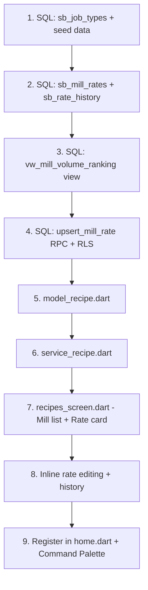

# Plan 02: Print Recipes — Mill Job Rates & Production Costing Hub

> **Status**: 🟡 Draft  
> **Priority**: High (daily rate tracking for production costing)  
> **Route**: Home Index 11 (new Production module)  
> **Estimated Complexity**: Medium (Tab 1 MVP) → Large (full recipe system)

---

## 1. Business Context

### What Are Print Recipes?

In Ambaji Sarees' manufacturing workflow, **"recipes"** are the cost blueprints for transforming raw grey fabric into finished sarees. Every saree passes through multiple processing stages — each charged at different rates by different contractors (mills, tailors, embroiderers). These rates:

- **Vary by mill** — different mills charge different rates for the same printing style
- **Vary by process type** — screen printing costs differently from digital printing
- **Change over time** — rates are renegotiated periodically, and history matters for cost analysis
- **Compound across stages** — a single saree's production cost is the sum of: mill printing + stitching + embroidery (siroski, jharkan, butta) + blouse work + lace + charak/polishing

Currently, these rates live in the heads of the team and scattered across WhatsApp messages. This module creates a **central, auditable rate repository** that feeds into production costing calculations.

### Why "Print Recipes" First?

The **Mill Job Rate** tab is the highest-volume, most immediately useful starting point:
- ATYPE 14 = Mills ("Creditors for Dyeing Job Charges") — these are the primary processing partners
- `sq_MILLREC.JOBRATE` already tracks the mill's processing charge per unit
- `sq_BILLDET.RATE` and `sq_BILLDET.SAREE_RATE` capture line-level pricing
- Mills are sorted by volume of goods processed — the busiest mills get attention first

### Future Tabs (Conceptualize Later)

| Tab | Purpose | When |
|-----|---------|------|
| **Mill Job Rates** | Printing/dyeing rates per mill per quality | ✅ Phase 1 (Tomorrow) |
| **Stitching Rates** | Tailor rates per quality (plain, fancy, designer) | Phase 2 |
| **Value Addition Catalog** | Siroski, Jharkan, Butta, Lace work rate cards | Phase 2 |
| **Finish Purchase Rates** | Ready purchase item rate tracking & changes | Phase 3 |
| **Composite Recipe Builder** | Full cost breakdown: grey + mill + stitch + VA = landed cost | Phase 3 |

---

## 2. Data Sources — What Already Exists

### 2.1 Mills in the System

**Source**: `sq_MASTER` WHERE `ATYPE = 14`

These are all the mills/processing houses Ambaji works with. The `CuttingService.getUniqueMills()` method already queries this.

### 2.2 Historical Rate Data

**Source**: `sq_MILLREC` (10,903 rows total, 464 active FY 26-27)

| Column | Purpose |
|--------|---------|
| `MILL_CODE` | Mill name/code (FK to `sq_MASTER`) |
| `GREYQUAL` | Grey quality being processed |
| `JOBRATE` | The rate charged by the mill |
| `RPCS` / `WPCS` | Pieces received (fresh/waste) — volume indicator |
| `lot` | Mill lot reference |
| `VNO` | Voucher number (for date/FY tracking) |

### 2.3 Job Work Rates in Bills

**Source**: `sq_BILLDET` WHERE `TYPE IN ('O5','O6','O7','O8','O9','O10','O11','O12')`

| Column | Purpose |
|--------|---------|
| `RATE` | Unit rate for the job work line |
| `SAREE_RATE` | Per-piece cost for the specific process |
| `qual` | Quality code |
| `PCS` / `MTS` | Volume |

### 2.4 Value Addition Types (Business Knowledge)

These are the distinct job work categories that form a saree's "recipe":

| Job Work Type | Description | Typical Rate Basis |
|---------------|-------------|-------------------|
| **Screen Print** | Rotary/flat screen printing at mill | Per meter |
| **Digital Print** | Digital printing at mill | Per meter |
| **Dyeing** | Plain dyeing/color treatment | Per meter |
| **Stitching (Plain)** | Basic fall-pico and blouse stitching | Per piece |
| **Stitching (Fancy)** | Designer border/pallu stitching | Per piece |
| **Siroski** | Crystal/stone embellishment work | Per piece |
| **Jharkan** | Tassel/jhalar fringe work | Per piece |
| **Butta Work** | Embroidered motif/butta placement | Per piece |
| **Lace Work** | Border lace attachment | Per meter |
| **Additional Blouse** | Extra blouse piece attachment | Per piece |
| **Charak/Polish** | Final calendering/finishing | Per piece |
| **Ironing/Press** | Pre-packing press | Per piece |

---

## 3. Database Schema

### 3.1 New Table: `IMMBE2627.sb_mill_rates`

This is the **rate card** — one row per mill × job type × quality combination. Rates are versioned so changes are tracked.

```sql
CREATE TABLE "IMMBE2627".sb_mill_rates (
    id UUID DEFAULT gen_random_uuid() PRIMARY KEY,
    
    -- Mill Identity
    mill_code TEXT NOT NULL,              -- FK to sq_MASTER.code (ATYPE=14)
    mill_name TEXT NOT NULL,              -- Cached name for display
    
    -- Job Classification  
    job_type TEXT NOT NULL,               -- 'screen_print', 'digital_print', 'dyeing', etc.
    job_label TEXT NOT NULL,              -- Display: 'Screen Print', 'Digital Print', etc.
    
    -- Rate Details
    current_rate NUMERIC(10,2) NOT NULL DEFAULT 0,
    rate_unit TEXT NOT NULL DEFAULT 'per_meter',  -- 'per_meter', 'per_piece', 'per_kg'
    
    -- Quality Scope (nullable = applies to all qualities at this mill)
    quality_code TEXT,                    -- FK to sq_QUAL.qcode (NULL = universal rate)
    quality_name TEXT,                    -- Cached quality name
    
    -- Rate History (latest change tracking)
    previous_rate NUMERIC(10,2),
    rate_changed_at TIMESTAMPTZ,
    rate_change_pct NUMERIC(5,2),         -- Auto-computed: ((new - old) / old * 100)
    
    -- Volume Stats (cached, refreshed periodically)
    total_pieces_processed INT DEFAULT 0,
    total_meters_processed NUMERIC(12,2) DEFAULT 0,
    last_job_date DATE,
    
    -- Audit
    created_by UUID REFERENCES auth.users(id),
    updated_by UUID REFERENCES auth.users(id),
    created_at TIMESTAMPTZ DEFAULT NOW(),
    updated_at TIMESTAMPTZ DEFAULT NOW(),
    notes TEXT,
    
    -- Uniqueness: one active rate per mill × job_type × quality
    UNIQUE(mill_code, job_type, quality_code)
);

-- Indexes
CREATE INDEX idx_mill_rates_mill ON "IMMBE2627".sb_mill_rates(mill_code);
CREATE INDEX idx_mill_rates_job ON "IMMBE2627".sb_mill_rates(job_type);
CREATE INDEX idx_mill_rates_quality ON "IMMBE2627".sb_mill_rates(quality_code);
```

### 3.2 Rate History Table: `IMMBE2627.sb_rate_history`

Full audit log of every rate change — never deleted, append-only.

```sql
CREATE TABLE "IMMBE2627".sb_rate_history (
    id UUID DEFAULT gen_random_uuid() PRIMARY KEY,
    rate_id UUID NOT NULL REFERENCES "IMMBE2627".sb_mill_rates(id) ON DELETE CASCADE,
    
    old_rate NUMERIC(10,2),
    new_rate NUMERIC(10,2) NOT NULL,
    change_pct NUMERIC(5,2),
    changed_by UUID REFERENCES auth.users(id),
    changed_by_name TEXT,
    changed_at TIMESTAMPTZ DEFAULT NOW(),
    reason TEXT                            -- Optional note: 'Season rate revision', 'Fuel surcharge'
);

CREATE INDEX idx_rate_history_rate ON "IMMBE2627".sb_rate_history(rate_id);
CREATE INDEX idx_rate_history_date ON "IMMBE2627".sb_rate_history(changed_at DESC);
```

### 3.3 Job Types Lookup: `IMMBE2627.sb_job_types`

Central catalog of all job work categories. Extensible — new types can be added without code changes.

```sql
CREATE TABLE "IMMBE2627".sb_job_types (
    id TEXT PRIMARY KEY,                  -- 'screen_print', 'siroski', etc.
    label TEXT NOT NULL,                  -- 'Screen Print', 'Siroski'
    category TEXT NOT NULL,               -- 'mill', 'stitching', 'value_addition', 'finishing'
    default_unit TEXT NOT NULL DEFAULT 'per_piece',  -- 'per_meter', 'per_piece', 'per_kg'
    sort_order INT NOT NULL DEFAULT 0,
    is_active BOOLEAN DEFAULT TRUE,
    created_at TIMESTAMPTZ DEFAULT NOW()
);

-- Seed data
INSERT INTO "IMMBE2627".sb_job_types (id, label, category, default_unit, sort_order) VALUES
    ('screen_print', 'Screen Print', 'mill', 'per_meter', 1),
    ('digital_print', 'Digital Print', 'mill', 'per_meter', 2),
    ('dyeing', 'Dyeing', 'mill', 'per_meter', 3),
    ('stitching_plain', 'Stitching (Plain)', 'stitching', 'per_piece', 10),
    ('stitching_fancy', 'Stitching (Fancy)', 'stitching', 'per_piece', 11),
    ('siroski', 'Siroski', 'value_addition', 'per_piece', 20),
    ('jharkan', 'Jharkan', 'value_addition', 'per_piece', 21),
    ('butta_work', 'Butta Work', 'value_addition', 'per_piece', 22),
    ('lace_work', 'Lace Work', 'value_addition', 'per_meter', 23),
    ('additional_blouse', 'Additional Blouse', 'value_addition', 'per_piece', 24),
    ('charak', 'Charak / Polish', 'finishing', 'per_piece', 30),
    ('ironing', 'Ironing / Press', 'finishing', 'per_piece', 31);
```

### 3.4 RLS Policies

```sql
-- All authenticated team members can read
CREATE POLICY "Team read" ON "IMMBE2627".sb_mill_rates FOR SELECT USING (auth.role() = 'authenticated');
CREATE POLICY "Team read" ON "IMMBE2627".sb_rate_history FOR SELECT USING (auth.role() = 'authenticated');
CREATE POLICY "Team read" ON "IMMBE2627".sb_job_types FOR SELECT USING (auth.role() = 'authenticated');

-- All authenticated can insert/update rates (rate changes are tracked in history)
CREATE POLICY "Team write rates" ON "IMMBE2627".sb_mill_rates FOR INSERT WITH CHECK (auth.role() = 'authenticated');
CREATE POLICY "Team update rates" ON "IMMBE2627".sb_mill_rates FOR UPDATE USING (auth.role() = 'authenticated');

-- History is append-only
CREATE POLICY "Team insert history" ON "IMMBE2627".sb_rate_history FOR INSERT WITH CHECK (auth.role() = 'authenticated');
```

---

## 4. Aggregation View — Mill Volume Ranking

To sort mills by highest volume, create a view that aggregates from `sq_MILLREC`:

```sql
CREATE OR REPLACE VIEW "IMMBE2627".vw_mill_volume_ranking AS
SELECT 
    m."MILL_CODE" AS mill_code,
    COALESCE(master."NAME", m."MILL_CODE") AS mill_name,
    COUNT(*) AS total_records,
    SUM(COALESCE(m."RPCS", 0)) AS total_pieces,
    SUM(COALESCE(m."fold_rmts", 0)) AS total_meters,
    MAX(m."_sync_time") AS last_activity,
    COUNT(CASE WHEN m."VNO" < 100000 THEN 1 END) AS active_fy_records,
    SUM(CASE WHEN m."VNO" < 100000 THEN COALESCE(m."RPCS", 0) ELSE 0 END) AS active_fy_pieces
FROM "IMMBE2627"."sq_MILLREC" m
LEFT JOIN "IMMBE2627"."sq_MASTER" master 
    ON master."code" = m."MILL_CODE" AND master."ATYPE" = 14
WHERE m."MILL_CODE" IS NOT NULL AND m."MILL_CODE" != ''
GROUP BY m."MILL_CODE", master."NAME"
ORDER BY active_fy_pieces DESC;
```

---

## 5. UI Design — Tab 1: Mill Job Rates

### 5.1 Page Layout

Standard `SystemAppMasterLayout` split-pane with pill tabs on top (same pattern as Grey Production pipeline page).

```
┌──────────────────────────────────────────────────────────────────────┐
│  OrganPaneHeader: "Print Recipes"   [Search]                        │
│  ┌─────────────────────────────────────────────────────────────────┐ │
│  │ [● Mill Job Rates]  [ Stitching ]  [ Value Additions ]  [+]   │ │
│  └─────────────────────────────────────────────────────────────────┘ │
├───────────────┬──────────────────────────────────────────────────────┤
│               │                                                      │
│  LEFT PANE    │           CONTENT PANE (Mill Rate Card)              │
│  (340px)      │                                                      │
│               │  ┌────────────────────────────────────────────────┐  │
│  Mills List   │  │  🏭 SHREE BALAJI PRINTS                       │  │
│  (by volume)  │  │  Total: 12,450 pcs · Last Job: 12 Jul 2026    │  │
│               │  ├────────────────────────────────────────────────┤  │
│  ┌──────────┐ │  │                                                │  │
│  │▶SHREE BAL│ │  │  JOB TYPE          RATE      UNIT    CHANGED  │  │
│  │  12,450pc│ │  │  ─────────────────────────────────────────────│  │
│  ├──────────┤ │  │  Screen Print      ₹ 18.50   /meter  12 Jul  │  │
│  │ JAY AMBE │ │  │  Digital Print     ₹ 32.00   /meter  01 Jul  │  │
│  │  8,200pc │ │  │  Dyeing            ₹ 12.00   /meter  15 Jun  │  │
│  ├──────────┤ │  │                                                │  │
│  │ KRISHNA  │ │  │  [+ Add Rate]                                  │  │
│  │  6,100pc │ │  │                                                │  │
│  ├──────────┤ │  ├────────────────────────────────────────────────┤  │
│  │ MAHALAXMI│ │  │  📊 Rate History                               │  │
│  │  4,800pc │ │  │  12 Jul: ₹18.50 (+5.7%) ← ₹17.50             │  │
│  ├──────────┤ │  │  01 Apr: ₹17.50 (—) Initial rate              │  │
│  │ SUNPRINT │ │  │                                                │  │
│  │  3,200pc │ │  └────────────────────────────────────────────────┘  │
│  └──────────┘ │                                                      │
│               │                                                      │
│  [Pagination] │                                                      │
├───────────────┴──────────────────────────────────────────────────────┤
│  Status: 42 mills · 156 active rates                                │
└──────────────────────────────────────────────────────────────────────┘
```

### 5.2 Left Pane — Mill Registry (sorted by volume)

- List of all mills from `vw_mill_volume_ranking`
- Each card shows: mill name, active FY pieces count, last activity date
- Search filters mill names
- **Sorted descending by `active_fy_pieces`** — busiest mills at top
- Uses `TissueListCard` with selection state
- Subtitle: `{active_fy_pieces} pcs · {active_fy_records} jobs`

### 5.3 Content Pane — Mill Rate Card

**Header Section** (inside `OrganSectionCanvas`):
- Mill name (large title)
- Volume stats: total pieces, total meters, last job date
- Mill ATYPE badge (Sky blue, chart5)

**Rate Table** (main content):
- List of all `sb_mill_rates` for the selected mill
- Each row: Job Type label, Current Rate (₹ formatted), Rate Unit, Last Changed date
- **Inline editing**: Click rate → converts to `CellInputNumber`, press Enter or blur → saves
- Rate change auto-creates `sb_rate_history` entry and shows `↑5.7%` or `↓3.2%` change indicator
- `[+ Add Rate]` button at bottom → dropdown of `sb_job_types` not yet assigned to this mill

**Rate History Section** (collapsible, below rate table):
- Chronological list of all rate changes for this mill
- Each entry: date, new rate, change %, old rate, who changed it, optional reason
- Uses timeline/list style with change direction indicators (green ↓ = rate decreased, red ↑ = rate increased)

### 5.4 Add Rate Flow

1. Click `[+ Add Rate]`
2. Dropdown shows available job types from `sb_job_types` (filtered to exclude already-assigned types)
3. Select job type → inline row appears with empty rate input
4. Enter rate → press Enter → row saves to `sb_mill_rates`
5. Optional: attach to specific quality (autocomplete from `sq_QUAL`)

### 5.5 Edit Rate Flow

1. Click existing rate value
2. Input becomes editable (`CellInputNumber` with ₹ prefix)
3. Type new rate → press Enter
4. System computes `change_pct`, saves to `sb_mill_rates`, creates `sb_rate_history` entry
5. Change indicator appears briefly (toast or inline badge)
6. Optional: prompt for reason text (small dialog)

---

## 6. Backend Components

### 6.1 Model: `model_recipe.dart`

```dart
@immutable
class MillVolumeModel {
  final String millCode;
  final String millName;
  final int totalRecords;
  final int totalPieces;
  final double totalMeters;
  final DateTime? lastActivity;
  final int activeFyRecords;
  final int activeFyPieces;
}

@immutable
class MillRateModel {
  final String id;
  final String millCode;
  final String millName;
  final String jobType;
  final String jobLabel;
  final double currentRate;
  final String rateUnit;
  final String? qualityCode;
  final String? qualityName;
  final double? previousRate;
  final DateTime? rateChangedAt;
  final double? rateChangePct;
  final int totalPiecesProcessed;
  final double totalMetersProcessed;
  final DateTime? lastJobDate;
  final String? notes;
  final DateTime createdAt;
  final DateTime updatedAt;
  
  // Computed
  String get rateFormatted => '₹ ${currentRate.toStringAsFixed(2)}';
  String get unitLabel => rateUnit == 'per_meter' ? '/meter' : rateUnit == 'per_piece' ? '/piece' : '/kg';
  bool get hasIncreased => rateChangePct != null && rateChangePct! > 0;
  bool get hasDecreased => rateChangePct != null && rateChangePct! < 0;
}

@immutable
class RateHistoryModel {
  final String id;
  final String rateId;
  final double? oldRate;
  final double newRate;
  final double? changePct;
  final String? changedByName;
  final DateTime changedAt;
  final String? reason;
}

@immutable
class JobTypeModel {
  final String id;
  final String label;
  final String category;
  final String defaultUnit;
  final int sortOrder;
  final bool isActive;
}
```

### 6.2 Service: `service_recipe.dart`

```dart
class RecipeService {
  // Singleton
  
  // -- Mill Registry (ranked by volume) --
  Future<PaginatedResult<MillVolumeModel>> getMillsByVolume({
    int offset, int limit, String? searchTerm
  });
  
  // -- Job Types Catalog --
  Future<List<JobTypeModel>> getJobTypes({String? category});
  
  // -- Mill Rates --
  Future<List<MillRateModel>> getRatesForMill(String millCode);
  Future<MillRateModel> upsertRate({
    required String millCode, required String millName,
    required String jobType, required String jobLabel,
    required double rate, required String rateUnit,
    String? qualityCode, String? qualityName, String? notes,
  });  // Creates sb_rate_history entry automatically
  Future<void> deleteRate(String rateId);
  
  // -- Rate History --
  Future<List<RateHistoryModel>> getRateHistory(String rateId);
  Future<List<RateHistoryModel>> getMillRateHistory(String millCode, {int limit = 20});
}
```

### 6.3 RPC: `upsert_mill_rate`

Rate changes must be transactional (update rate + insert history atomically):

```sql
CREATE OR REPLACE FUNCTION "IMMBE2627".upsert_mill_rate(
    p_mill_code TEXT,
    p_mill_name TEXT,
    p_job_type TEXT,
    p_job_label TEXT,
    p_rate NUMERIC,
    p_rate_unit TEXT,
    p_quality_code TEXT DEFAULT NULL,
    p_quality_name TEXT DEFAULT NULL,
    p_notes TEXT DEFAULT NULL,
    p_user_id UUID DEFAULT NULL,
    p_user_name TEXT DEFAULT NULL
) RETURNS UUID AS $$
DECLARE
    v_rate_id UUID;
    v_old_rate NUMERIC;
    v_change_pct NUMERIC;
BEGIN
    -- Check if rate exists
    SELECT id, current_rate INTO v_rate_id, v_old_rate
    FROM "IMMBE2627".sb_mill_rates
    WHERE mill_code = p_mill_code 
      AND job_type = p_job_type 
      AND COALESCE(quality_code, '') = COALESCE(p_quality_code, '');
    
    IF v_rate_id IS NOT NULL THEN
        -- Update existing
        v_change_pct := CASE WHEN v_old_rate > 0 
            THEN ROUND(((p_rate - v_old_rate) / v_old_rate * 100)::NUMERIC, 2)
            ELSE NULL END;
        
        UPDATE "IMMBE2627".sb_mill_rates SET
            current_rate = p_rate,
            previous_rate = v_old_rate,
            rate_changed_at = NOW(),
            rate_change_pct = v_change_pct,
            updated_by = p_user_id,
            updated_at = NOW(),
            notes = COALESCE(p_notes, notes)
        WHERE id = v_rate_id;
        
        -- Insert history
        INSERT INTO "IMMBE2627".sb_rate_history 
            (rate_id, old_rate, new_rate, change_pct, changed_by, changed_by_name)
        VALUES (v_rate_id, v_old_rate, p_rate, v_change_pct, p_user_id, p_user_name);
    ELSE
        -- Insert new
        INSERT INTO "IMMBE2627".sb_mill_rates 
            (mill_code, mill_name, job_type, job_label, current_rate, rate_unit,
             quality_code, quality_name, created_by, updated_by, notes)
        VALUES (p_mill_code, p_mill_name, p_job_type, p_job_label, p_rate, p_rate_unit,
                p_quality_code, p_quality_name, p_user_id, p_user_id, p_notes)
        RETURNING id INTO v_rate_id;
        
        -- Insert initial history entry
        INSERT INTO "IMMBE2627".sb_rate_history 
            (rate_id, old_rate, new_rate, change_pct, changed_by, changed_by_name, reason)
        VALUES (v_rate_id, NULL, p_rate, NULL, p_user_id, p_user_name, 'Initial rate');
    END IF;
    
    RETURN v_rate_id;
END;
$$ LANGUAGE plpgsql;
```

---

## 7. Open Questions

> [!NOTE]
> **Q1 — Quality-Specific Rates**: Should mill rates be universal (one screen print rate per mill) or quality-specific (different rate for DANI vs GEORGETTE at the same mill)? The schema supports both — `quality_code` is nullable.

> [!NOTE]
> **Q2 — Historical Rate Import**: Should we auto-populate `sb_mill_rates` from historical `sq_MILLREC.JOBRATE` data? This would give instant visibility into existing rates without manual entry.

> [!NOTE]
> **Q3 — Navigation Slot**: Should Print Recipes get its own sidebar slot (Index 11), or should it be a sub-tab within the existing Production Pipeline page (Index 5)?

---

## 8. Acceptance Criteria (Tab 1 MVP)

- [ ] `sb_mill_rates`, `sb_rate_history`, `sb_job_types` tables created with RLS
- [ ] `vw_mill_volume_ranking` view deployed
- [ ] `upsert_mill_rate` RPC deployed
- [ ] `sb_job_types` seeded with 12 initial job types
- [ ] `model_recipe.dart` with `MillVolumeModel`, `MillRateModel`, `RateHistoryModel`, `JobTypeModel`
- [ ] `service_recipe.dart` singleton with all CRUD methods
- [ ] Print Recipes screen registered in home.dart navigation
- [ ] Tab bar: "Mill Job Rates" active, other tabs as disabled placeholders
- [ ] Left pane: mills sorted by volume with piece count subtitles
- [ ] Content pane: rate card table with inline edit capability
- [ ] Add Rate flow with job type dropdown
- [ ] Rate history section (collapsible timeline)
- [ ] Rate change tracking with % indicators
- [ ] Search mills by name
- [ ] Zero compiler errors

---

## 9. Gemini Execution Prompt

> **Copy the prompt below into a new Antigravity IDE conversation with Gemini.**

---

````markdown
## Task: Build Print Recipes Module — Tab 1: Mill Job Rates

You are building a new **Print Recipes** page for the Ambaji Sarees ERP — a central repository for tracking mill processing rates, job work pricing, and value addition costs across the textile production pipeline. This is Phase 1: the **Mill Job Rates** tab.

### Pre-Reading (MANDATORY)
Before writing any code, read these files in order:
1. `/flutter` workflow (use the slash command)
2. `docs/plans/02_print_recipes.md` — the full architectural plan (this document)
3. `docs/architecture_pattern_guide.md` — model/service patterns
4. `frontend/lib/screens/home.dart` — navigation structure
5. `frontend/lib/screens/production/grey_screen.dart` — reference for tab-based production screen pattern
6. `frontend/lib/services/service_cutting.dart` — reference service pattern
7. `frontend/lib/constants/legacy_constants.dart` — ATYPE 14 = Mills

### Phase 1: Database Setup
1. Create schema doc at `backend/schema_docs/06_recipes/sb_mill_rates.md` documenting all 3 tables
2. Write and apply SQL migrations for:
   - `sb_job_types` table with seed data (12 job types)
   - `sb_mill_rates` table with indexes and uniqueness constraint
   - `sb_rate_history` table with indexes
   - `vw_mill_volume_ranking` view (aggregates from `sq_MILLREC`)
   - `upsert_mill_rate` RPC function
   - RLS policies for all 3 tables
3. Apply via Supabase MCP or document for manual execution

### Phase 2: Data Layer
1. Create `frontend/lib/models/model_recipe.dart`:
   - `MillVolumeModel` — mill with volume ranking data from the view
   - `MillRateModel` — rate card entry with change tracking
   - `RateHistoryModel` — individual rate change audit entry
   - `JobTypeModel` — job type catalog entry
   - All with defensive `fromJson` factories, computed getters for formatting
   - Include `rateFormatted` (₹ with 2 decimals), `unitLabel` (/meter, /piece), change direction helpers

2. Create `frontend/lib/services/service_recipe.dart`:
   - Singleton pattern matching `CuttingService`
   - `getMillsByVolume()` — paginated query from `vw_mill_volume_ranking`, searchable by mill name
   - `getJobTypes()` — fetch from `sb_job_types`, optionally filtered by category
   - `getRatesForMill(millCode)` — fetch all rates for a mill from `sb_mill_rates`
   - `upsertRate()` — calls the `upsert_mill_rate` RPC
   - `deleteRate()` — deletes from `sb_mill_rates`
   - `getRateHistory(rateId)` — fetch history for a specific rate
   - `getMillRateHistory(millCode)` — fetch recent rate changes across all job types for a mill
   - All methods use `.schema('IMMBE2627')`

### Phase 3: UI — Print Recipes Screen
1. Create `frontend/lib/screens/production/recipes_screen.dart`
2. Register at a new route index in `home.dart` — add sidebar entry and command palette action
3. Use `LucideIcons.chefHat` or `LucideIcons.receipt` for the sidebar icon

**Page Structure:**
- `OrganPaneHeader` with title "Print Recipes" and search
- `TissueTabs` pill navigation below header: `Mill Job Rates` (active), `Stitching` (disabled), `Value Additions` (disabled), `Finish Purchase` (disabled)
- `SystemAppMasterLayout` split-pane

**Left Pane (340px) — Mill Registry:**
- Fetch from `vw_mill_volume_ranking` via `service_recipe.getMillsByVolume()`
- Each `TissueListCard`:
  - Title: mill name
  - Subtitle: `{active_fy_pieces} pcs · {active_fy_records} jobs`  
  - Trailing: `CellBadge` with "Mill" label using chart5 (Sky) color
- Search filters by mill name
- Sorted by `active_fy_pieces` descending (busiest first)
- `TissuePagination` at bottom

**Content Pane — Rate Card (when mill selected):**
- `OrganSectionCanvas` with mill name as title
- Header card (`TissueCard`): mill name, total pieces, total meters, last activity date
- Rate table section:
  - Column headers: Job Type, Current Rate, Unit, Last Changed, Actions
  - Each rate row from `service_recipe.getRatesForMill()`:
    - Job type label (left-aligned text)
    - Current rate in `CellInputNumber` (₹ formatted, editable on click)
    - Rate unit text (/meter or /piece)
    - Last changed date (relative: "3 days ago" or absolute)
    - Change indicator: green `↓3.2%` or red `↑5.7%` badge using `CellBadge` success/destructive variant
    - Delete icon button (ghost variant, `LucideIcons.trash2`)
  - When rate value is edited (blur or Enter):
    - Call `service_recipe.upsertRate()` with new value
    - Refresh rate list
    - Show toast: "Screen Print rate updated: ₹17.50 → ₹18.50 (+5.7%)"
  - `[+ Add Rate]` button at bottom:
    - Opens inline row with `CellCombobox` of available job types (from `sb_job_types`, excluding already-assigned)
    - After selection, shows empty rate input → Enter saves

- Rate History section (below rate table):
  - Collapsible with "Rate History" header
  - Fetch from `service_recipe.getMillRateHistory(millCode)`
  - Each entry: date, job type label, new rate, change %, old rate, who changed
  - Use a simple list with subtle dividers

**Empty State (no mill selected):**
- `TissueEmptyState` with icon `LucideIcons.factory`, title "Select a Mill", message "Choose a mill from the registry to view and manage processing rates."

### Design System Rules
- Use `OrganismTheme.colorsOf(context)` for ALL colors
- Rate increase badge: `CellBadge` with `customColor` using `colors.error` (red for cost increase)
- Rate decrease badge: `CellBadge` with `customColor` using `colors.chart3` (green for cost savings)
- Mill badge: `CellBadge` with `customColor` using `colors.chart5` (Sky — matches ATYPE 14)
- Use `CellInputNumber` for rate editing with `prefix: '₹'`
- Use `TissueCard` for content sections
- Use `TissueFormField` for any editable metadata
- Import from `../../organism_design/index.dart`

### Important Constraints
- File names: `model_recipe.dart`, `service_recipe.dart`, `recipes_screen.dart`
- Place screen in `frontend/lib/screens/production/`
- Check `if (!mounted) return;` after every `await`
- Use `LucideIcons` exclusively
- Defensive JSON parsing in all models
- Handle empty states gracefully — new mills may have zero rates
- The disabled tabs should be visible but non-interactive (show tooltip "Coming soon")
- Keyboard: Enter to confirm rate edit, Escape to cancel edit, Tab to move between rate inputs
````

---

## 10. Implementation Order



**Estimated effort**: 1–2 focused sessions for Gemini.
